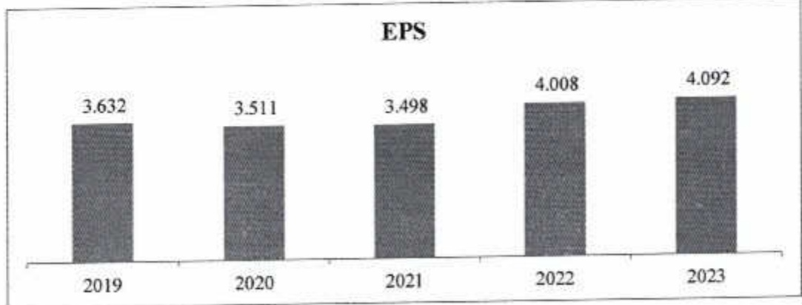

#### 2.2.5. Hoạt động ngân hàng số

Năm 2023 tiếp tục là một năm đối mới về hoạt động ngân hàng số khi cho ra mất nhiều sản phẩm và tiện ích mới, mang đến nhiều trải nghiệm tốt hơn cho người dùng. Mở đầu là việc ra mất dòng thế liên kết Urbox tích điểm đối quả và ngân hàng tự động ACB Lite cung cấp nhiều dịch vụ nổi bật như mở tài khoản thanh toán bằng công nghệ eKYC¹¹ và video call (dịch vụ thoại có kèm hình ảnh), phát hành nhanh thẻ Visa Debit. Ngoài ra, ACB cũng đem đến giải pháp thanh toán thông minh cho doanh nghiệp thông qua ứng dụng ACB One Connect.

Các sản phẩm và tính năng hỗ trợ người dùng trực tuyến không ngừng được bỏ sung và nâng cấp, như giải ngân trực tuyến, mua bán ngoại tệ trực tuyến, liên kết ví điện tử / thu hộ với các đối tác fintech. Trong năm 2023, ACB được ghi nhận là 1 trong 6 ngân hàng đầu tiên cung cấp dịch vụ thanh toán liên kết với Apple Pay tại Việt Nam.

Hoạt động phát triển khách hàng thông qua các giải pháp tiếp thị tự động (automation marketing - Insider), với công cụ theo dõi mạng (tracking tool - AppsFlyer) và liên kết với các đối tác fintech tiếp tục được ACB triển khai tích cực trong năm 2023. Hiện ACB đang có gần 1,6 triệu khách hàng trực tuyến eKYC và 60 nghìn doanh nghiệp thông qua dịch vụ đăng ký trực tuyến e-form.

Số lượng giao dịch và giá trị giao dịch trực tuyến tăng mạnh ở mức tương ứng là 51% và 15% so với năm trước, trong đó có đến 78% doanh số giao dịch thực hiện trên ACB Mobile App. Cơ cấu giao dịch tiếp tục dịch chuyển mạnh từ kênh truyền thống sang kênh điện tử; theo đó tỷ lệ giao dịch điện tử tăng từ 33% lên 82%, giao dịch tại quầy chi còn 4% tính đến cuối năm 2023; cho thấy xu hướng ngân hàng số đang dần trở thành kênh giao dịch phổ biến.