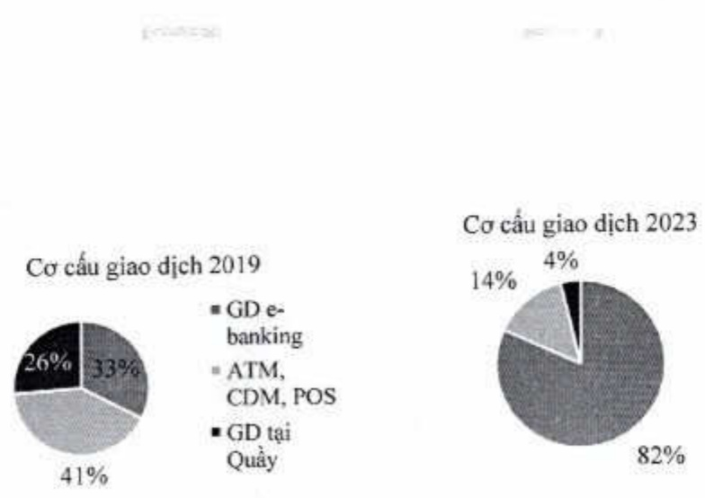

#### 3. Những cải tiến về cơ cấu tổ chức, chính sách và công tác quản lý

##### 3.1 Thay đổi cơ cấu tổ chức

Trong năm 2023, để đáp ứng yêu cầu tuân thủ quy định của pháp luật và hoặc nhu cầu riêng của mình, ACB đã sửa đổi và bổ sung chức năng, nhiệm vụ và cơ cấu tổ chức của một số đơn vị tại Hội sở, cụ thể là Khối Công nghệ thông tin, Khối Quản lý rủi ro, Khối Khách hàng cá nhân, Khối Khách hàng doanh nghiệp, và Phòng Quản trị truyền thông và thương hiệu.

##### 3.2. Cải tiến về chính sách quản lý rủi ro

Dự án Nâng cấp hệ thống phòng chống rửa tiền, tài trợ khùng bổ và phổ biến vũ khí hủy diệt hàng loạt được triển khai trong năm 2023 và dự kiến kết thúc trong năm 2024. Dự án này nhằm nâng cao hiệu quả giám sát, cánh báo rủi ro thông qua việc tự động hóa các quy trình sáng lực, đánh giá rủi ro khách hàng, sáng lực và giám sát giao dịch, chuẩn hóa các báo cáo quản trị về hoạt động phòng chống rửa tiền. Các chính sách, quy định, quy trình được hoàn thiện theo hướng tuân thủ quy định của pháp luật Việt Nam, tiệm cận các chuẩn mực quốc tế, và cân bằng với thực tiễn hoạt động kinh doanh và định hướng phát triển của Ngân hàng.

##### 3.3. Cải tiến về công tác quản lý về mạng vận hành

Trong năm 2023, hoạt động vận hành tiếp tục được cải tiến theo hướng số hóa quy trình, nhằm giảm thù tục, giấy tờ ký kết giữa ACB với khách hàng, giảm thời gian giao dịch và xử lý giao dịch của khách hàng. Dưới đây là một số cải tiến tiêu biểu:

(i) Tiếp tục mở rộng phạm vi giải ngân online đối với khách hàng doanh nghiệp để thanh toán tiền hàng nhập khẩu qua kênh ACB One Biz. Đồng thời, triển khai tính năng giải ngân online đối với khách hàng cá nhân với sản phẩm cho vay sản xuất kinh doanh, bổ sung vốn lưu động qua kênh ACB One.

(ii) Số hóa quy trình tự vấn và cung ứng dịch vụ giao dịch tại quầy, tối thiểu hóa lượng chứng từ giấy phải in, tăng mức độ tự động trong quy trình xử lý, giảm thời gian thao tác/diểm chạm của khách hàng trong giao dịch tại kênh phân phối:

Hệ thống Green Transactions (giao dịch xanh) được nâng cấp cho phép cùng lúc xử lý tự động nhiều giao dịch (nhiều loại nghiệp vụ) theo nhu cầu của khách hàng.