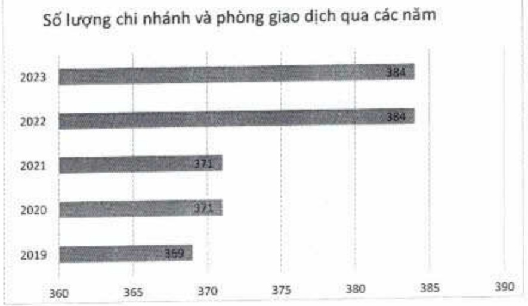
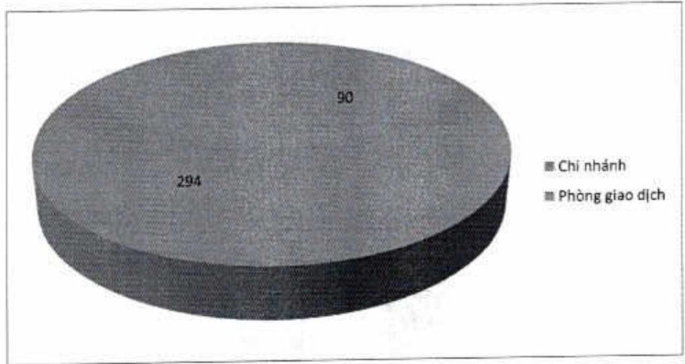

### VIII. MẠNG LUỐI CHI NHÁNH VÀ PHÒNG GIAO DỊCH

Tính đến cuối năm 2023, ACB có 90 CN và 294 PGD, tổng cộng là 384 đơn vị kênh phân phối, hiện diện trên 49 tính thành trong số 63 tính thành cả nước. CN và PGD tập trung chủ yếu tại TP. Hồ Chí Minh và Hà Nội.

Số lượng chi nhánh và phòng giao dịch trong năm năm qua.

Số lượng chỉ nhánh và phòng giao dịch cuối năm 2023

