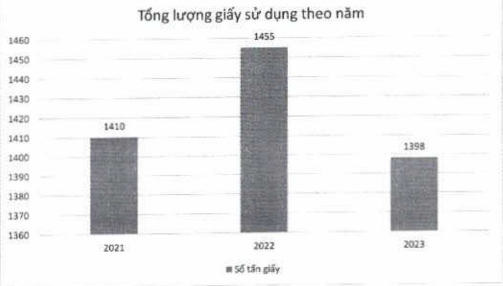

##### 2.3. Tổng quan thực hành phát triển bền vững về mặt môi trường

###### 2.3.1. Quản lý vật liệu

ACB đấy mạnh triển khai sáng kiến sử dụng vật liệu hiệu quả, tiết kiệm giấy trên toàn Tập đoàn.

• Quản lý tiêu thụ giấy

Giấy là loại vật liệu chính yếu được sử dụng trong hoạt động hàng ngày của ACB.

(DVT: Tần)

<table border=1 style='margin: auto; word-wrap: break-word;'><tr><td style='text-align: center; word-wrap: break-word;'>Loại vật liệu</td><td style='text-align: center; word-wrap: break-word;'>2021</td><td style='text-align: center; word-wrap: break-word;'>2022</td><td style='text-align: center; word-wrap: break-word;'>2023</td></tr><tr><td style='text-align: center; word-wrap: break-word;'>Giấy $ ^{(1)} $</td><td style='text-align: center; word-wrap: break-word;'>1.410</td><td style='text-align: center; word-wrap: break-word;'>1.455</td><td style='text-align: center; word-wrap: break-word;'>1.398</td></tr></table>

Lượng giấy sử dụng của Ngân hàng ACB, không bao gồm các công ty con.

Lượng giấy sử dụng tăng tử 1.410 tấn vào năm 2021 lên 1.455 tấn vào năm 2022 do nhu cầu hoạt động cao sau dịch Covid-19. Đến năm 2023 lượng giấy sử dụng đã giảm còn 1.398 tấn nhờ mục tiêu sử dụng tiết kiệm sử dụng giấy luôn được ACB đầy mạnh thực hiện trong năm 2023, tương ứng với tỷ lệ giám so với năm 2022 là 4%.

+ Giấy sử dụng tại ACB được mua từ nhà cung cấp bên ngoài bao gồm các loại giấy in cho hợp đồng, văn bản; giấy có logo ACB để sử dụng giao dịch như biên lai thu tiền, úy nhiệm chi và các ăn phẩm như lịch và sở tay.