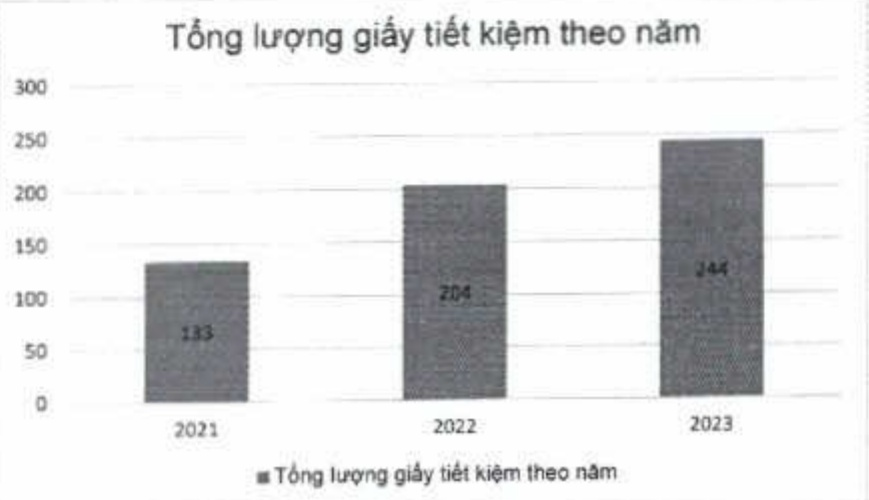

#### • Giấy tiết kiệm

+ Hàng tấn giấy được ACB tiết kiệm trong năm 2023 do liên tục thực hiện số hóa quy trình theo các chương trình Gần Lại O, như Green Transactions, Go Paperless Credit, v.v., cụ thể là ACB đã tiết kiệm khoảng 244 tấn giấy trong năm 2023, tăng 19,6% so với năm 2022.

(ĐVT: Tần)

<table border=1 style='margin: auto; word-wrap: break-word;'><tr><td style='text-align: center; word-wrap: break-word;'>Số lượng</td><td style='text-align: center; word-wrap: break-word;'>2021</td><td style='text-align: center; word-wrap: break-word;'>2022</td><td style='text-align: center; word-wrap: break-word;'>2023</td></tr><tr><td style='text-align: center; word-wrap: break-word;'>Giấy tiết kiệm</td><td style='text-align: center; word-wrap: break-word;'>133</td><td style='text-align: center; word-wrap: break-word;'>204</td><td style='text-align: center; word-wrap: break-word;'>244</td></tr></table>

+ Bên cạnh đó, lượng giấy đã qua sử dụng cần tiêu hủy sẽ được ACB tái chế để sử dụng nhiều lần, qua đó giảm được lượng rác thải từ giấy.

- Giấy được tài chế

+ Đối với các chứng từ cần tiêu hủy, ACB đã chuyển cho các nhà máy giấy để cắt nhỏ, phần loại và mang đi tái chế.

(ĐVT: Tần)

<table border=1 style='margin: auto; word-wrap: break-word;'><tr><td style='text-align: center; word-wrap: break-word;'>Số lượng</td><td style='text-align: center; word-wrap: break-word;'>2021</td><td style='text-align: center; word-wrap: break-word;'>2022</td><td style='text-align: center; word-wrap: break-word;'>2023</td></tr><tr><td style='text-align: center; word-wrap: break-word;'>Giấy được tái chế</td><td style='text-align: center; word-wrap: break-word;'>33</td><td style='text-align: center; word-wrap: break-word;'>11</td><td style='text-align: center; word-wrap: break-word;'>38</td></tr><tr><td style='text-align: center; word-wrap: break-word;'>Tỷ lệ giấy được tái chế (%)</td><td style='text-align: center; word-wrap: break-word;'>2</td><td style='text-align: center; word-wrap: break-word;'>1</td><td style='text-align: center; word-wrap: break-word;'>3</td></tr></table>

Biểu đồ Tổng lượng giấy tái chế theo năm