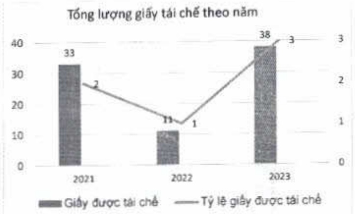

Năm 2023, tỷ lệ giấy được tài chế đã tăng lên mức 3% so với tổng lượng giấy tiêu thụ tại ACB.

#### Hạn chế sử dụng vật liệu nhựa

+ Hầu hết các vật dụng bằng nhựa tại ACB đều được thay bằng các vật liệu thân thiện môi trường; ví dụ như túi vài thay cho túi nhựa; ly giấy thay cho ly nhựa; ly thủy tinh dùng trong phòng hợp thay vì chai nhựa trong suốt (PET); bao dựng lịch tăng cho khách hàng, đối tác được làm bằng giấy thay cho nhựa, v.v. Hành động này làm giảm đáng kể lượng nhựa đang tiêu thụ tại ACB với khoảng 91 tấn nhựa tương đương đã được ACB thay thế trong ba năm bằng các vật liệu như ly giấy và túi vài không đặt, cụ thể với số liệu sau:

(ĐVT: Tần)

<table border=1 style='margin: auto; word-wrap: break-word;'><tr><td style='text-align: center; word-wrap: break-word;'>Số lượng nhựa tương đương</td><td style='text-align: center; word-wrap: break-word;'>2021</td><td style='text-align: center; word-wrap: break-word;'>2022</td><td style='text-align: center; word-wrap: break-word;'>2023</td></tr><tr><td style='text-align: center; word-wrap: break-word;'>Túi vài không đệt</td><td style='text-align: center; word-wrap: break-word;'>26</td><td style='text-align: center; word-wrap: break-word;'>29</td><td style='text-align: center; word-wrap: break-word;'>26</td></tr><tr><td style='text-align: center; word-wrap: break-word;'>Lấy giấy</td><td style='text-align: center; word-wrap: break-word;'>2</td><td style='text-align: center; word-wrap: break-word;'>3</td><td style='text-align: center; word-wrap: break-word;'>5</td></tr><tr><td style='text-align: center; word-wrap: break-word;'>Tổng</td><td style='text-align: center; word-wrap: break-word;'>28</td><td style='text-align: center; word-wrap: break-word;'>32</td><td style='text-align: center; word-wrap: break-word;'>31</td></tr></table>