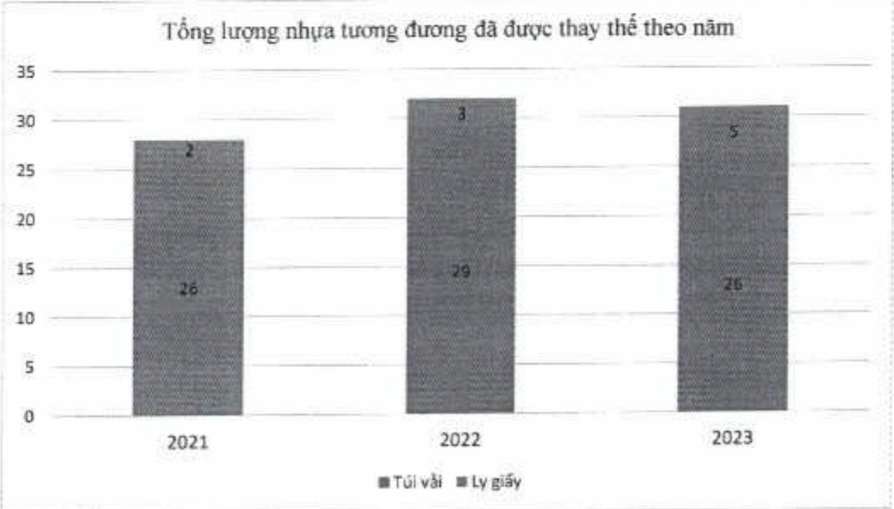

+ Ngoài ra, thay vì mua vật dụng có tỷ lệ nhựa cao như thâm sản cho các tòa nhà lớn, thì ACB mua thâm tái chế từ lưới đánh cá cũ của ngư dân, góp phần giảm thiếu sử dụng nhựa và lượng GHG.

+ Trong tương lai, ACB dự kiến sẽ sử dụng vân tay để thay thế cho thế nhân viên hiện đang làm bằng nhựa để giảm thiểu hơn nữa lượng nhựa sử dụng.

###### 2.3.2. Tiêu thụ năng lượng

ACB hướng đến mục tiêu tiết giảm năng lượng tiêu thụ. Ngườn năng lượng tiêu thụ tại ACB bao gồm hai loại chính là diện năng sử dụng để vận hành cho các hoạt động và xăng sử dụng cho các phương tiện vận chuyển.

(ĐVT: Têrajun)

<table border=1 style='margin: auto; word-wrap: break-word;'><tr><td style='text-align: center; word-wrap: break-word;'>Loại năng lượng</td><td style='text-align: center; word-wrap: break-word;'>2021</td><td style='text-align: center; word-wrap: break-word;'>2022</td><td style='text-align: center; word-wrap: break-word;'>2023</td></tr><tr><td style='text-align: center; word-wrap: break-word;'>Điện năng $ ^{(1)} $</td><td style='text-align: center; word-wrap: break-word;'>139</td><td style='text-align: center; word-wrap: break-word;'>145</td><td style='text-align: center; word-wrap: break-word;'>132</td></tr><tr><td style='text-align: center; word-wrap: break-word;'>Xăng $ ^{(2)} $</td><td style='text-align: center; word-wrap: break-word;'>43</td><td style='text-align: center; word-wrap: break-word;'>63</td><td style='text-align: center; word-wrap: break-word;'>49</td></tr><tr><td style='text-align: center; word-wrap: break-word;'>Tổng</td><td style='text-align: center; word-wrap: break-word;'>182</td><td style='text-align: center; word-wrap: break-word;'>208</td><td style='text-align: center; word-wrap: break-word;'>181</td></tr></table>