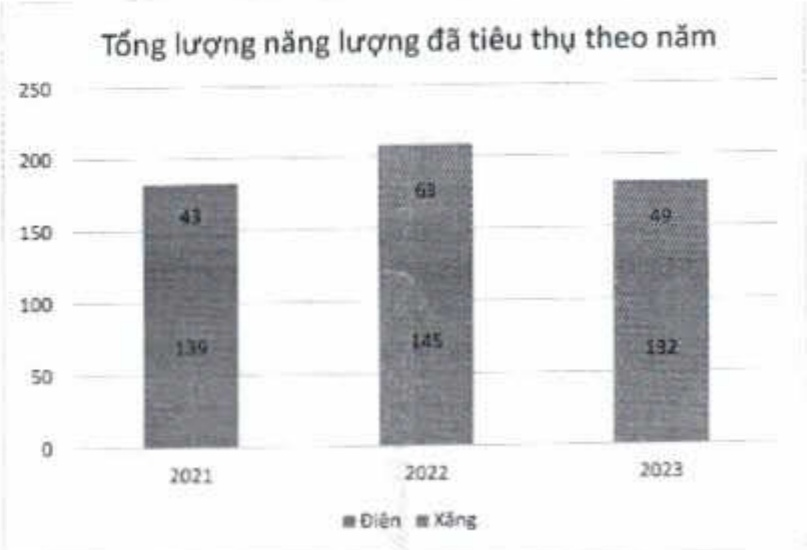

(1) Điện năng tiêu thụ của Tập đoàn ACB.

(2) Xăng tiêu thụ của Ngân hàng ACB, không bao gồm các công ty con.

+ Nhờ áp dụng các biện pháp tiết kiệm năng lượng như lắp đặt các thiết bị tiêu thụ điện năng lượng hiệu quả, tất các thiết bị khi không sử dụng, v.v. tổng lượng năng lượng tiêu thụ tăng trong năm 2023 đã giảm còn 181 Têrajun, so với mức 182 Têrajun năm 2021 và 208 Têrajun năm 2022, tương đương tỷ lệ giảm so với năm 2021 và 2022 lần lượt là 1% và 13%.

+ Đại da số năng lượng tiêu thụ chính của ACB là điện năng được mua trực tiếp từ EVN để vận hành cho các hoạt động tại toàn Tập đoàn ACB, với 132 Têrajun trong năm 2023, và chiếm tỷ lệ khoảng 73% so tổng lượng năng lượng tiêu thụ.

+ Trong năm 2023 nhờ vào các chính sách tiết kiệm năng lượng, đặc biệt là việc triển khai sáng kiến tất máy tính sau giờ làm việc nhằm tiết kiệm điện đã giúp năng lượng tiêu thụ giảm 13%.

+ Xăng dùng cho các phương tiện vận chuyển mà ACB sở hữu hoặc kiểm soát (xe công vụ, xe chuyển dùng, v.v.) là loại năng lượng tiêu thụ chính thứ hai của ACB, với 49 Têrajun trong năm 2023, khoảng 27% so tổng lượng năng lượng tiêu thụ.

+ Trong năm 2023, ACB đã triển khai hệ thống điều xe mới, làm tăng hiệu quả sử dụng năng lượng đáng kể, kết quả là tổng lượng xăng tiêu thụ trong năm đã giảm 22% so với năm 2022.

Nhận thức rõ năng lượng không tái tạo ngày càng khan hiểm không chỉ tại Việt Nam mà trên cả toàn cầu "cũng như các tác động đến môi trường từ việc sử dụng năng lượng không tái tạo", dù như cầu tiêu thụ năng lượng cho hoạt động tăng nhưng ACB luôn đặt mục tiêu giảm tiêu thụ năng lượng lên hàng đầu.

Điện năng