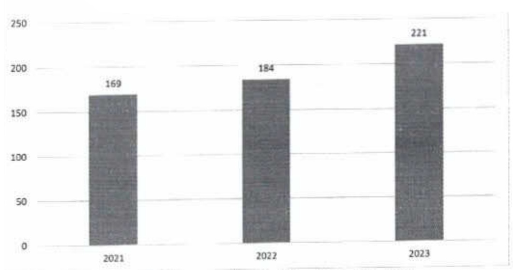

+ ACB đã sớm thay đèn hủynh quang bằng đèn LED có hiệu suất chiếu sáng và mức độ tiết kiệm điện năng cao hơn. ACB cũng đã sử dụng kính đôi trong các tòa nhà lớn để lấy ảnh sáng tự nhiên và hạn chế nhiệt bên trong tòa nhà, qua đó làm giám lượng điện cần cho chiếu sáng và hệ thống điều hòa.

+ Trồng cây, phù rộng màng xanh để hạn chế sử dụng năng lượng cho hệ thống điều hòa cũng là biện pháp mà ACB thực hiện từ những năm qua.

+ ACB sẽ chuyển đổi thiết kế xây dựng các tòa nhà làm việc theo hướng công trình xanh thân thiện với môi trường, lấy ảnh sáng và thông gió tự nhiên, hạn chế nhu cầu tiêu thụ điện xuống mức tối thiểu.

##### Xăng

Lượng xăng tiêu thụ phụ thuộc vào nhu cầu sử dụng dịch vụ của khách hàng, nhưng ACB luôn kiểm soát để tối ưu hóa lượng xăng sử dụng, đáp ứng yêu cầu cần thiết của công việc.

###### 2.3.3. Tiêu thụ nước

ACB xây dựng và đề cao ý thức sử dụng tiết kiệm nước trong nhân viên. Nước tiêu thụ tại ACB được mua từ nguồn cấp nước độ thị và dùng cho sinh hoạt hàng ngày của nhân viên ACB, chi tiết:

<table border=1 style='margin: auto; word-wrap: break-word;'><tr><td style='text-align: center; word-wrap: break-word;'></td><td style='text-align: center; word-wrap: break-word;'>2021</td><td style='text-align: center; word-wrap: break-word;'>2022</td><td style='text-align: center; word-wrap: break-word;'>2023</td></tr><tr><td style='text-align: center; word-wrap: break-word;'>Lương nước tiêu thụ (Mega lit) $ ^{(1)} $</td><td style='text-align: center; word-wrap: break-word;'>169</td><td style='text-align: center; word-wrap: break-word;'>184</td><td style='text-align: center; word-wrap: break-word;'>221</td></tr></table>

Tổng lượng nước tiêu thụ theo năm (Megalit)

(1) Lượng nước tiêu thụ được tổng hợp thống kê số liệu từ Tập đoàn ACB.

