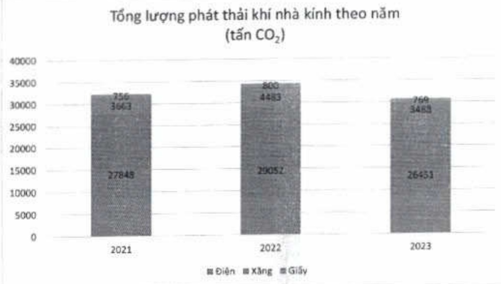

So với năm 2022 và năm 2021, tổng lượng nước tiểu thụ năm 2023 lần lượt tăng là 20% và 31%. Tổng lượng nước tiểu thụ tăng từ 184 megalít trong năm 2022 và 169 megalít trong năm 2021 lên 221 megalít trong năm 2023.

Mặc dù phải tiêu thụ nhiều nước hơn cho việc cải tạo xây dựng các tòa nhà và phục hồi phát triển hoạt động kinh doanh, nhưng ACB luôn xây dựng và đề cao ý thức sử dụng tiết kiệm nước trong nhân viên ACB thông qua các bản tin gửi đến nhân viên.

#### 2.3.4. Phát thải khi nhà kinh (GHG)

ACB sử dụng năng lượng hợp lý và thực hiện các biện pháp trung hòa, góp phần giảm phát thải GHG.

Nguồn phát thải GHG từ ACB vào môi trường chủ yếu đến từ hai loại năng lượng đang được sử dụng là điện, xăng và một phần nhỏ phát sinh từ tiêu thụ giấy; chi tiết như bảng bên dưới:

(ĐVT: Tần CO₂)

<table border=1 style='margin: auto; word-wrap: break-word;'><tr><td style='text-align: center; word-wrap: break-word;'>Nguồn phát thải</td><td style='text-align: center; word-wrap: break-word;'>2021</td><td style='text-align: center; word-wrap: break-word;'>2022</td><td style='text-align: center; word-wrap: break-word;'>2023</td></tr><tr><td style='text-align: center; word-wrap: break-word;'>Diện năng $ ^{(1)} $</td><td style='text-align: center; word-wrap: break-word;'>27.848</td><td style='text-align: center; word-wrap: break-word;'>29.052</td><td style='text-align: center; word-wrap: break-word;'>26.451</td></tr><tr><td style='text-align: center; word-wrap: break-word;'>Xăng $ ^{(2)} $</td><td style='text-align: center; word-wrap: break-word;'>3.663</td><td style='text-align: center; word-wrap: break-word;'>4.483</td><td style='text-align: center; word-wrap: break-word;'>3.488</td></tr><tr><td style='text-align: center; word-wrap: break-word;'>Giấy $ ^{(2)} $</td><td style='text-align: center; word-wrap: break-word;'>758</td><td style='text-align: center; word-wrap: break-word;'>800</td><td style='text-align: center; word-wrap: break-word;'>769</td></tr><tr><td style='text-align: center; word-wrap: break-word;'>Tổng</td><td style='text-align: center; word-wrap: break-word;'>31.685</td><td style='text-align: center; word-wrap: break-word;'>34.335</td><td style='text-align: center; word-wrap: break-word;'>30.708</td></tr></table>

Phát thái do tiêu thụ điện năng được thống kê tổng hợp số liệu từ Tập đoàn ACB.

(2) Phát thải do tiêu thụ xăng, giấy được thống kê tổng hợp số liệu của Ngân hàng ACB, không bao gồm các công ty con.