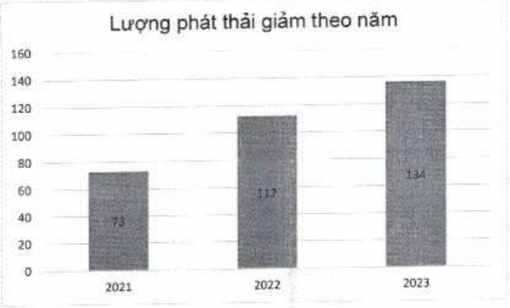

ĐVT: Tấn CO₂

<table border=1 style='margin: auto; word-wrap: break-word;'><tr><td style='text-align: center; word-wrap: break-word;'>Các biển pháp giảm phát thải (tần  $ CO_{2} $)</td><td style='text-align: center; word-wrap: break-word;'>2021</td><td style='text-align: center; word-wrap: break-word;'>2022</td><td style='text-align: center; word-wrap: break-word;'>2023</td></tr><tr><td style='text-align: center; word-wrap: break-word;'>Tiết kiệm giảy</td><td style='text-align: center; word-wrap: break-word;'>73</td><td style='text-align: center; word-wrap: break-word;'>112</td><td style='text-align: center; word-wrap: break-word;'>134</td></tr></table>

##### » Trung hòa carbon

Lượng phát thái khí nhà kinh phát sinh trong hoạt động vận hành hàng ngày, nhất là khí CO₂, là không thể tránh khói, nên ACB chủ trọng thực hiện các biện pháp trung hòa carbon bằng cách loại bỏ carbon hoặc đền bù carbon. Trong năm 2023, khoảng 43 tấn CO₂ tương đương đã được ACB đền bù thông qua sử dụng thảm tái chế, kỹ hợp đồng sử dụng dịch vụ GoGreen Plus của DHL nhằm giám lượng khí thái carbon cho các lỗ hàng chuyển phát nhanh quốc tế và các chương trình Gần lại O.

<table border=1 style='margin: auto; word-wrap: break-word;'><tr><td style='text-align: center; word-wrap: break-word;'>Các biện pháp trung hòa</td><td style='text-align: center; word-wrap: break-word;'>2023</td></tr><tr><td style='text-align: center; word-wrap: break-word;'>Thảm tái chế</td><td style='text-align: center; word-wrap: break-word;'>39</td></tr><tr><td style='text-align: center; word-wrap: break-word;'>Dự án GoGreen Plus của DHL hợp tác cùng ACB</td><td style='text-align: center; word-wrap: break-word;'>4</td></tr><tr><td style='text-align: center; word-wrap: break-word;'>Dự án Thu dọn “Rác thải nhựa”</td><td style='text-align: center; word-wrap: break-word;'>7,3</td></tr><tr><td style='text-align: center; word-wrap: break-word;'>Tổng</td><td style='text-align: center; word-wrap: break-word;'>50,3</td></tr></table>

- Thám tái chế từ lưới đánh cá là loại thảm trong Chương trình Thám trung hòa carbon (The Carbon Neutral Floors) được chứng nhận tiêu chuẩn PAS 2060 của Viện Tiêu chuẩn Anh về nỗ lực quản lý và giảm phát thải khí nhà kinh. ACB đã dùng loại thảm này cho các tòa nhà lớn của mình.