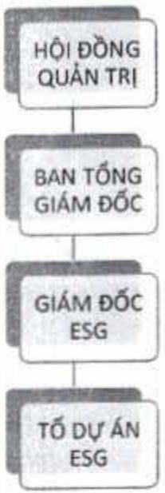

Khách hàng: ACB tuân thủ theo đúng quy định của pháp luật về quản lý rủi ro môi trường, xã hội tại Thông tư 17/2022/TT-NHNN ngày 23/12/2022 Hướng dẫn thực hiện quản lý rủi ro về môi trường trong hoạt động cấp tính dụng của TCTD, chi nhánh ngân hàng nước ngoài, đồng thời ACB không tài trợ các dự án vi phạm pháp luật về bảo vệ môi trường.

- ACB ưu tiên vốn tín dụng và nguồn lực tài chính vào lĩnh vực tín dụng xanh, thân thiện môi trường. ACB không hướng vốn tín dụng vào những dự án gây ảnh hưởng tới môi trường. Định hướng này đã được ACB quy định trong Định hướng chính sách quản lý rủi ro tín dụng và chính sách quản lý rủi ro môi trường, theo đó quy định cụ thể định hướng cấp tín dụng vào các lĩnh vực xanh, thân thiện môi trường, đồng thời quy định chính sách cấp tín dụng vào các nhóm ngành nghề có rủi ro tác động đến môi trường, xã hội, cũng như nguyên tắc quản lý rủi ro môi trường xã hội và ràng buộc tính pháp lý về các cam kết bảo vệ môi trường của khách hàng. Đồng thời, ACB cũng quy định cụ thể tiêu chí đánh giá và lựa chọn các dự án đầu tư tuân thủ điều kiện/quy định tín dụng cũng như thú tục lựa chọn, đánh giá khách hàng/khoản vay có tác động đến rủi ro môi trường, xã hội.

- Ngoài ra, khi thực hiện cho cấp tính dụng các dự án ngoài việc chọn lọc các dự án thỏa đều kiện/tiêu chí bảo vệ môi trường như nêu trên, trong quá trình cấp tính dụng ACB thực hiện kiểm tra, đánh giá sau cho vay để đảm bảo khách hàng tuần thú các điều kiện bảo vệ môi trường, xã hội.

#### 3. Xã hội

3.1. Tổng quan thực hành phát triển bền vững về mặt xã hội