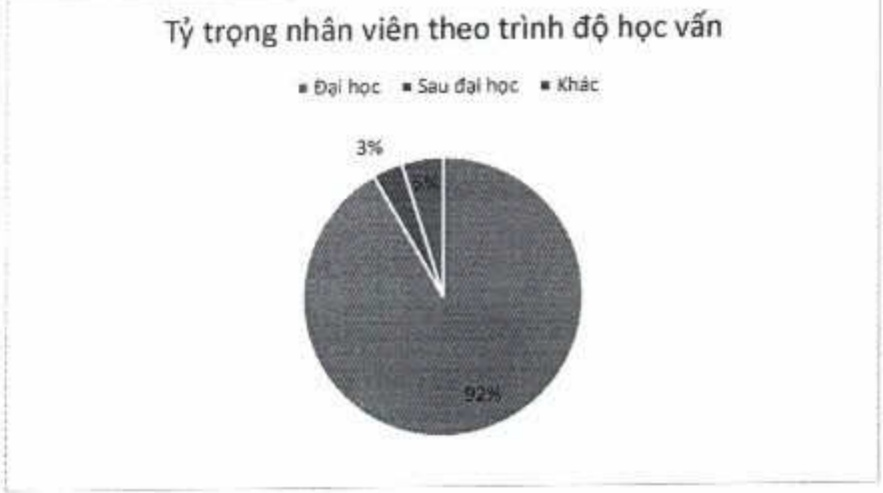

ACB luôn quan tâm đến việc gia tăng tính gắn bó của nhóm nhân sự chất lượng. Trong năm 2023, tỷ lệ nhóm nhân viên đạt kỳ vọng trở lên thời việc là 8,1% giảm 1,7 điểm phần trăm so với năm 2022 và thấp hơn so với kế hoạch đặt ra khoảng 2%. ACB đã xây dựng chính sách, cơ chế và lộ trình tác động kịp thời, tích cực đến nhóm nhân viên thường xuyên không đạt yêu cầu nhằm đồng hành và thức đấy cái thiện hiệu quả công việc.

#### 3.2.2. Đào tạo và phát triển

ACB thường xuyên cấp nhất, nâng cao kiến thức nghiệp vụ chuyên môn cho người lao động trong lĩnh vực phụ trách để họ làm chủ công việc và có cơ hội thắng tiến.

Trình độ học vấn của nhân viên ACB:

<table border=1 style='margin: auto; word-wrap: break-word;'><tr><td style='text-align: center; word-wrap: break-word;'>Trinh độ học vấn</td><td style='text-align: center; word-wrap: break-word;'>Số lượng (nhân viên)</td><td style='text-align: center; word-wrap: break-word;'>Tỷ trọng (%)</td></tr><tr><td style='text-align: center; word-wrap: break-word;'>Đại học</td><td style='text-align: center; word-wrap: break-word;'>12.523</td><td style='text-align: center; word-wrap: break-word;'>91,7</td></tr><tr><td style='text-align: center; word-wrap: break-word;'>Sau đại học</td><td style='text-align: center; word-wrap: break-word;'>476</td><td style='text-align: center; word-wrap: break-word;'>3,5</td></tr><tr><td style='text-align: center; word-wrap: break-word;'>Khác</td><td style='text-align: center; word-wrap: break-word;'>656</td><td style='text-align: center; word-wrap: break-word;'>4,8</td></tr><tr><td style='text-align: center; word-wrap: break-word;'>Tổng công</td><td style='text-align: center; word-wrap: break-word;'>13.655</td><td style='text-align: center; word-wrap: break-word;'>100</td></tr></table>

##### Đào tạo

Không chi phát triển hài hòa các khía cạnh Work:Live:Learn, năm 2023 đánh dấu sự điều chỉnh linh hoạt của ACB để tối ưu hiệu quả công việc và phát triển nhân tài, thích ứng với những biến động của thị trường và chiến lược kinh doanh của tổ chức.

Trong hoạt động học tập, bên cạnh các chương trình đào tạo được lập kế hoạch, tổ chức thường niên theo quy định của NHNN, yếu cầu chung của ngân hàng, hơn 250 khóa học mới được xây dựng và triển khai đa dạng hình thức từ lớp học tập trung, lớp học online, tư vấn giải đáp nhóm, cá nhân, hội thảo chia sẻ. Nội dung học tập được thiết kế nhằm đáp ứng nhu cầu của từng đơn vị đặc thù hoặc từng mảng năng lực chuyên biệt tại ACB. Mục đích triển khai và kết quả sau đào tạo được rà soát để đảm bảo hiệu quả nâng cao năng lực cần thiết, đóng khoảng trống, điểm