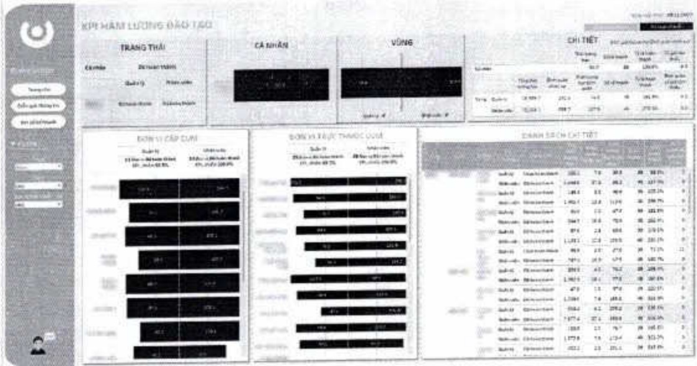

yếu của đội ngũ và tăng cường kiến thức, kỹ năng giúp tối ưu hiệu suất công việc. Chỉ số hoàn thành KPIs học tập trong năm theo từng nhóm đối tượng cụ thể cũng là tiêu chí xem xét trong quá trình phát triển nghề nghiệp của mỗi nhân sự tại tổ chức.

Nhân viên và cấp quản lý tại ACB có thể dễ dàng theo dõi lịch sử, bảng biểu thế hiện thời lượng học tập của cá nhân và đơn vị; đồng thời sử dụng danh mục học tập theo chức danh và khóa học khuyến nghị để không ngừng nâng cao kiến thức phù hợp cho bản thân.

Hệ thống học tập cũng được đầu tư và trên lộ trình tích hợp để tối ưu trải nghiệm cho người học. Cụ thể các khóa học được phân nhóm phù hợp để mở rộng phạm vi truy cấp, giúp nhân viên có thể chủ động học tập từ xa. Điểm số được cấp nhất nhanh chóng và hình thức các khóa học ngày càng theo hướng game hóa để gia tăng tính hấp dẫn cho người tham dự.