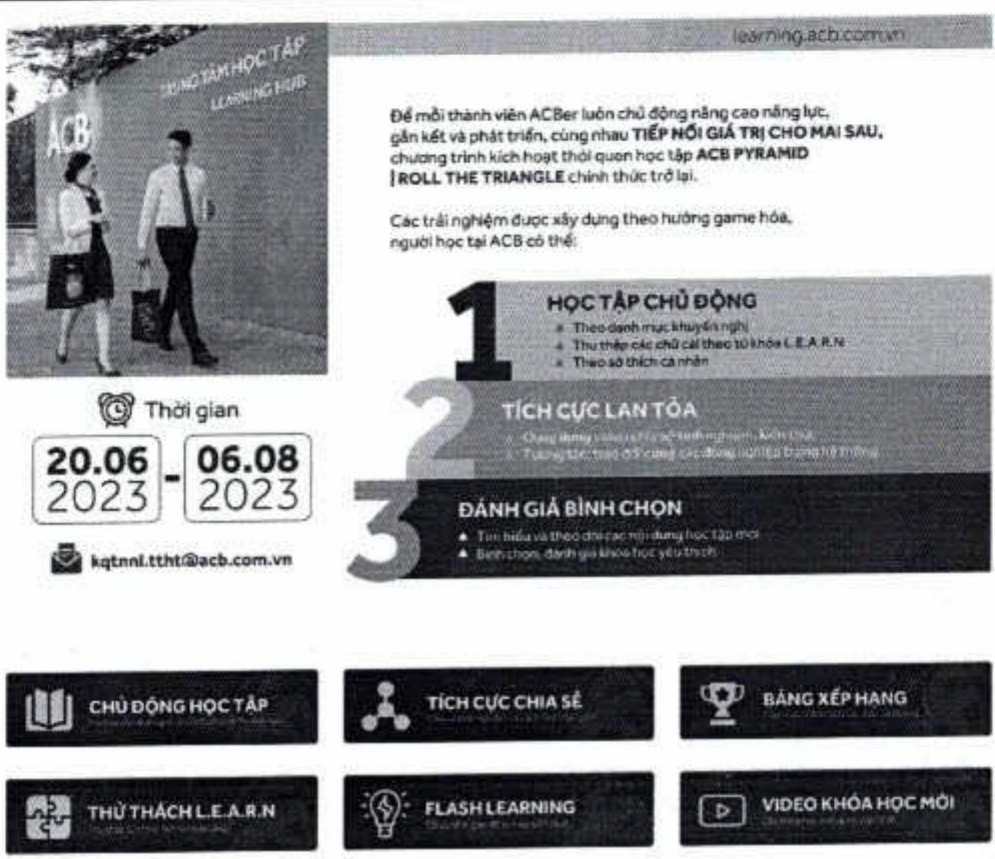

Bên cạnh đó, chương trình thi đua học tập ACB Pyramid mừng sinh nhất ngân hàng 30 năm Te hay hoạt động kích hoạt văn hóa học tập Learn:Do:Share được lan tóa từ chính các cộng đồng nhân tài trong hệ thống như The Next Leader, chương trình Mentoring Coaching, đào tạo chuyển đổi Thêm 1 độ càng gia tăng tính chủ động hoàn thiện, phát triển năng lực của mỗi người ACB.

Năm 2023, ACB đặt tổng số giờ học 856.831 giờ, tăng khoảng 13% so với năm 2022 với số ngày học trung bình đạt 11 ngày/nhân viên/năm. Theo đó, số giờ học trung bình toàn hệ thống và theo phần nhóm như sau:

<table border=1 style='margin: auto; word-wrap: break-word;'><tr><td style='text-align: center; word-wrap: break-word;'>Phân nhóm</td><td style='text-align: center; word-wrap: break-word;'>Tổng số giờ học</td><td style='text-align: center; word-wrap: break-word;'>Số lượng NV bình quân</td><td style='text-align: center; word-wrap: break-word;'>Số giờ học trung bình</td></tr><tr><td style='text-align: center; word-wrap: break-word;'>Nhân viên</td><td style='text-align: center; word-wrap: break-word;'>745.304</td><td style='text-align: center; word-wrap: break-word;'>11.045</td><td style='text-align: center; word-wrap: break-word;'>67,48</td></tr><tr><td style='text-align: center; word-wrap: break-word;'>Quản lý</td><td style='text-align: center; word-wrap: break-word;'>111.527</td><td style='text-align: center; word-wrap: break-word;'>1.904</td><td style='text-align: center; word-wrap: break-word;'>58,58</td></tr><tr><td style='text-align: center; word-wrap: break-word;'>Tổng</td><td style='text-align: center; word-wrap: break-word;'>856.831</td><td style='text-align: center; word-wrap: break-word;'>12.949</td><td style='text-align: center; word-wrap: break-word;'>66,17</td></tr></table>