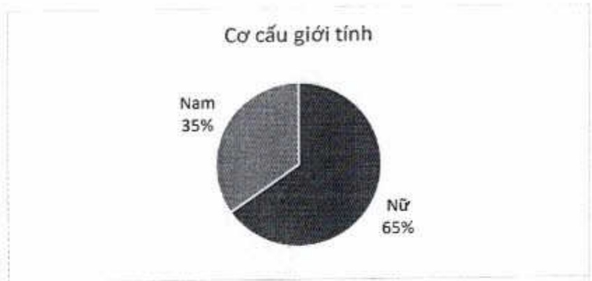

#### Phát triển nghề nghiệp

ACB cập nhất hệ thống mô tả công việc, xây dựng định hướng phát triển nhân viên và tiến trình nghề nghiệp cho các cá nhân cụ thể ở mỗi vị trí, chức vụ và phòng ban.

ACB thúc đẩy cấp quản lý hoàn thành kế hoạch kinh doanh, cải thiện năng lực huấn luyện và phát triển đội ngũ tại đơn vị và sản sàng tham gia học tập kiến thức mới.

Tại ACB, nhân viên còn được tạo điều kiện khi có nhu cầu chuyển vị trí hoặc phòng ban công tác. Nhân viên chủ động đăng ký các khóa kỹ năng, chuyên môn liên quan đến vị trí hoặc phòng ban đề chuẩn bị sản sàng chuyển đổi.

### Chương trình "The Next Leader" (Nhà lãnh đạo tiếp nối)

Là chương trình phát triển đội ngũ nhân sự tiềm năng, bởi đường nâng cao năng lực chuyên môn, kỹ năng quản lý và chuẩn bị các yếu tố sản sàng để kế thừa các vị trí chủ chốt trong tương lai. Ngoài ra, ACB luôn tạo điều kiện và cơ hội hỗ trợ các nhân viên có nhu cầu tự nguyện chuyển vị trí công việc, địa điểm làm việc sang các phòng ban khác.

#### 3.2.3. Bình đẳng giới tính và cơ hội

ACB tạo cơ hội phát triển cho toàn thể nhân viên, bình đẳng và không phần biết đối xử giới tính, vùng miền, v.v.

ACB tạo cơ hội phát triển cho toàn thể nhân viên. Các chính sách về bình đẳng giới tính và cơ hội tại ACB được quy định cụ thể trong nội quy lao động và thỏa ước lao động tập thể, và được áp dụng xuyên suốt trong tất cả các hoạt động của ACB, như tuyển dụng, đào tạo, bổ trí công việc, phát triển nghề nghiệp, quản lý quan hệ lao động, lương và chế độ phúc lợi.

Tỷ lệ nhân viên nữ tại ACB tính đến ngày 31 tháng 12 năm 2023 là 65,29%.

Thống kê theo giới tính

<table border=1 style='margin: auto; word-wrap: break-word;'><tr><td style='text-align: center; word-wrap: break-word;'>Giới tính</td><td style='text-align: center; word-wrap: break-word;'>Số lượng</td><td style='text-align: center; word-wrap: break-word;'>Tỷ trọng (%)</td></tr><tr><td style='text-align: center; word-wrap: break-word;'>Nữ</td><td style='text-align: center; word-wrap: break-word;'>8.915</td><td style='text-align: center; word-wrap: break-word;'>65.29</td></tr><tr><td style='text-align: center; word-wrap: break-word;'>Nam</td><td style='text-align: center; word-wrap: break-word;'>4.740</td><td style='text-align: center; word-wrap: break-word;'>34.71</td></tr><tr><td style='text-align: center; word-wrap: break-word;'>Tổng cộng</td><td style='text-align: center; word-wrap: break-word;'>13.655</td><td style='text-align: center; word-wrap: break-word;'>100</td></tr></table>

