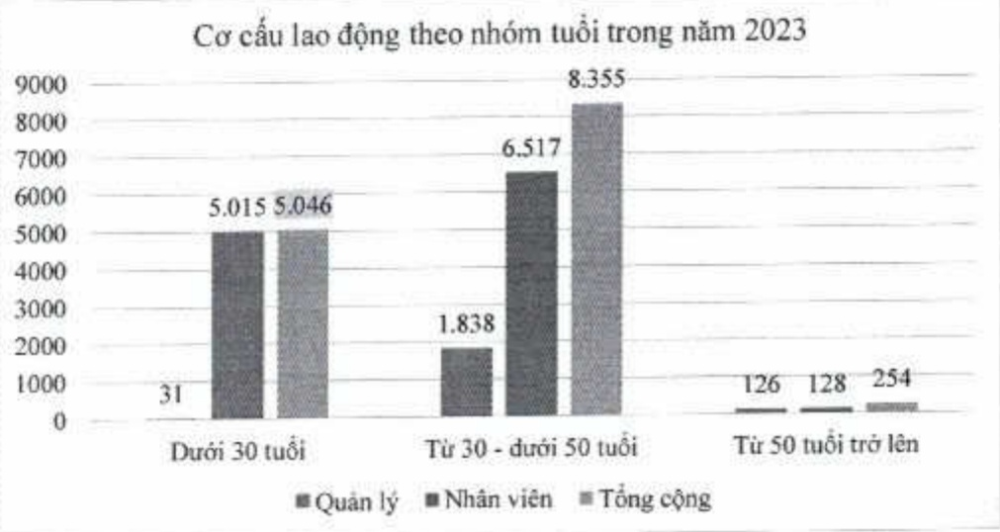

Cơ cấu lao động theo nhóm tuổi

<table border=1 style='margin: auto; word-wrap: break-word;'><tr><td style='text-align: center; word-wrap: break-word;'>Nhóm tuổi</td><td style='text-align: center; word-wrap: break-word;'>Quản lý</td><td style='text-align: center; word-wrap: break-word;'>Nhân viên</td><td style='text-align: center; word-wrap: break-word;'>Tổng cộng</td></tr><tr><td style='text-align: center; word-wrap: break-word;'>Dưới 30 tuổi</td><td style='text-align: center; word-wrap: break-word;'>31</td><td style='text-align: center; word-wrap: break-word;'>5.015</td><td style='text-align: center; word-wrap: break-word;'>5.046</td></tr><tr><td style='text-align: center; word-wrap: break-word;'>Từ 30 - dưới 50 tuổi</td><td style='text-align: center; word-wrap: break-word;'>1.838</td><td style='text-align: center; word-wrap: break-word;'>6.517</td><td style='text-align: center; word-wrap: break-word;'>8.355</td></tr><tr><td style='text-align: center; word-wrap: break-word;'>Từ 50 tuổi trở lên</td><td style='text-align: center; word-wrap: break-word;'>126</td><td style='text-align: center; word-wrap: break-word;'>128</td><td style='text-align: center; word-wrap: break-word;'>254</td></tr><tr><td style='text-align: center; word-wrap: break-word;'>Tổng cộng</td><td style='text-align: center; word-wrap: break-word;'>1.995</td><td style='text-align: center; word-wrap: break-word;'>11.660</td><td style='text-align: center; word-wrap: break-word;'>13.655</td></tr></table>

###### 3.2.4. Đãi ngộ

Các chế độ đại ngộ có tham chiếu thị trường và luôn được điều chỉnh, nâng cao, thực hiện công bằng và minh bạch.

Các chế độ đại ngộ của ACB có tham chiếu thị trường và luôn được điều chỉnh, nâng cao, thực hiện công bằng và minh bạch.

### Thu nhập bình quân của nhân viên trong năm 2023 là 441 triệu đồng.

Thu nhập của nhân viên được xác định theo kết quả hoàn thành công việc của Ngân hàng, đơn vị và cá nhân. ACB đã xây dựng hệ thống do lường hiệu quả công việc của nhân viên (balanced scorecard - BSC) nhằm đảm bảo quy trình quản trị lương thương được khách quan, chính xác và nhanh chóng.

##### Phúc lợi khác

Sức khỏe: Mỗi năm ACB nâng hạn mức chương trình chăm sóc sức khỏe toàn diện (ACB Care) cho toàn bộ nhân viên. Ngoài ra, ACB còn có chương trình hỗ trợ bảo hiểm sức khỏe