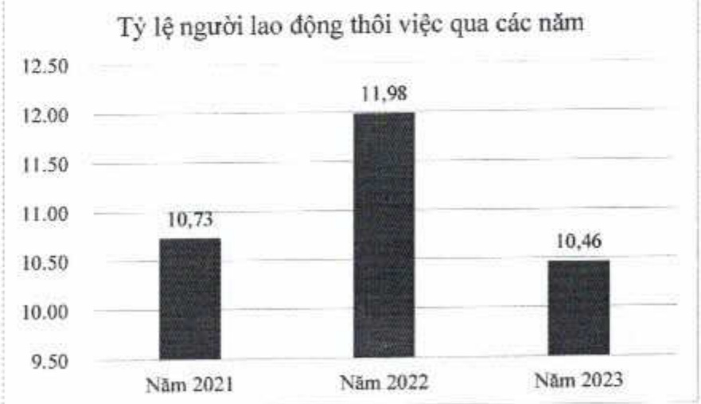

Tỷ lệ lao động thôi việc được tổng hợp thống kê số liệu chi từ Ngân hàng ACB, không bao gồm các công ty con.

Từ cuối năm 2019, ACB triển khai các chính sách tác động đến nhóm không đạt kỳ vọng nhằm gia tăng chất lượng nhân sự.

##### 3.3. Thấu hiểu và tập trung vào khách hàng

Tại ACB, tư duy “khách hàng là trọng tâm” được thể hiện như sau:

###### 3.3.1. Trải nghiệm khách hàng

Với định hướng khách hàng là trọng tâm, ACB không ngừng nổ lực trong hoạt động thiết kế/cải tiến sản phẩm dịch vụ và quy trình nhằm đem lại trải nghiệm khách hàng vượt trội. Qua đó, đáp ứng nhu cầu ngày càng cao của khách hàng cũng như tăng cường khả năng cạnh tranh của ACB.

Tiếp nổi năm 2022, năm 2023 ACB tiếp tục triển khai các dự án chiến lược liên quan đến quy trình thiết kế trải nghiệm khách hàng, bao gồm bốn bước chính:

(1) Thấu hiểu khách hàng;

(2) Nghiên cứu hành trình hiện tại của khách hàng;

(3) Xác định vấn đề ảnh hưởng đến trải nghiệm khách hàng; và

(4) Xây dựng giải pháp xử lý vấn đề.

###### 3.3.2. Lắng nghe khách hàng

Mức độ hài lòng của khách hàng với ACB được duy trì ở điểm số tốt. ACB dành nhiều nguồn lực cho hoạt động thấu hiểu khách hàng (phân tích chân dung, nhu cầu, hành vi tài chính, trải nghiệm của khách hàng tại từng điểm chạm, kênh tương tác, sản phẩm) nhằm thu thập thông tin toàn diện cho hoạt động thiết kế trải nghiệm của khách hàng đối với sản phẩm dịch vụ.

Để đảm bảo phần hồi của khách hàng được tiếp cận và giải quyết kịp thời, triệt để nhằm duy trì, nâng cao chất lượng phục vụ và làm cơ sở cho việc xem xét cải tiến sản phẩm dịch vụ, quy