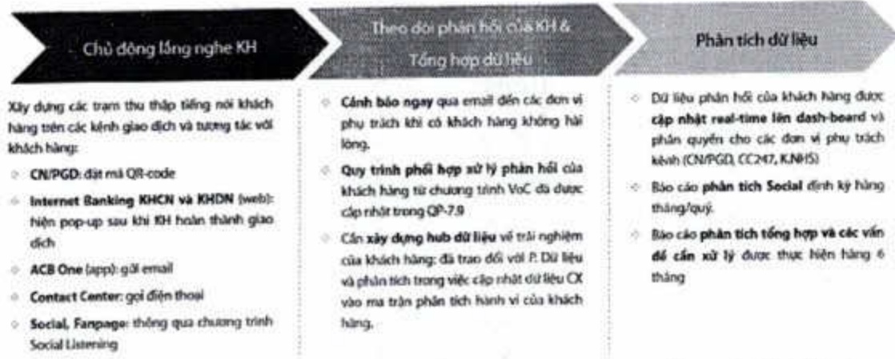
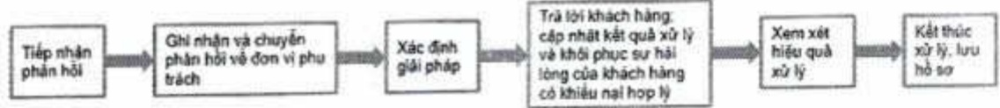

trình, quy định, v.v. ACB đã xây dựng quy trình tiếp nhận phần hồi khách hàng một cách có hệ thống thông qua các kênh trực tiếp tại các chi nhánh, phòng giao dịch hoặc Hội sở ACB, điện thoại, chat, email, văn bản, chương trình tiếng nói khách hàng (Voice of Customer) và các hình thức tiếp nhận thông tin khác từ cơ quan truyền thông, cơ quan Nhà nước hoặc mạng xã hội.

Nói bật là chương trình Tiếng nói khách hàng (Voice of Customer, gọi tất là "VoC") với các mục đích và hình thức triển khai như sau:

Quy trình xử lý phần hồi khách hàng của ACB bao gồm các bước:

Quy trình xử lý phân hồi khách hàng của ACB có sự phối hợp giữa Trung tâm thế (24/7), chỉ nhánh/ phòng giao dịch với đơn vị quản lý nghiệp vụ tại Hội sở.

+ Trung tâm thê (24/7): tiếp nhận và tập trung giải quyết phân hồi liên quan đến thê (áp dụng từ năm 2022).

+ Khối Ngân hàng số: tiếp nhận và tập trung giải quyết phân hồi liên quan đến ngân hàng số (áp dụng từ năm 2022).

+ Ban giám đốc chỉ nhánh, phòng giao dịch: tiếp nhận và giải quyết thông tin phản hồi khách hàng theo hồ sơ đang phụ trách.

100% Phần hồi từ khách hàng được xem xét và xử lý trong năm 2023.

99% Khách hàng đồng ý với việc xử lý của ACB đối với các phần hồi trong năm 2023.

###### 3.3.3. Bảo mật thông tin khách hàng

Với ACB, mục tiêu bảo mật thông tin khách hàng luôn được đặt lên hàng đầu, nhằm tuần thù quy định của pháp luật liên quan và gia tăng lòng tin của khách hàng.

a. Hệ thống công nghệ thông tin