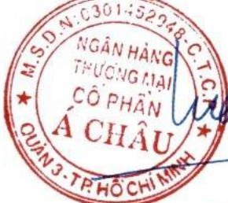

NGÂN HÀNG TMCP Á CHÂU

Số: 3850 /CV-VPHĐQT.25

# CỘNG HÒA XÃ HỘI CHỦ NGHĨA VIỆT NAM ĐỘC LẬP - TỪ DO - HẠNH PHÚC

TP. Hồ Chí Minh, ngày 24 tháng 3 năm 2025

# CÔNG BÓ THÔNG TIN TRÊN CỔNG THÔNG TIN ĐIỆN TỬ CỦA ỨY BAN CHỨNG KHOÁN NHÀ NƯỚC VÀ SỞ GIAO DỊCH CHỨNG KHOÁN TP. HÒ CHÍ MINH

Kính gửi: Ủy ban Chứng khoán Nhà nước

Sở Giao dịch Chứng khoán TP. Hồ Chí Minh

Tên tổ chức: NGÂN HÀNG TMCP Á CHÂU

Mã chúng khoán: ACB

Trụ sở chính : 442 Nguyễn Thị Minh Khai, Phường 5, Quận 3, TP. Hồ Chí Minh.

Điện thoại : (84-28) 3929 0999

Fax : (84-28) 3839 9885

Người thực hiện công bố thông tin: Ông Đàm Văn Tuấn

Địa chỉ : 442 Nguyễn Thị Minh Khai, Phường 5, Quận 3, TP. Hồ Chí Minh.

Điện thoại : (84-28) 3929 0999

Fax : (84-28) 3839 9885

Loại thông tin công bố: □ 24h □ 72h □ Yêu cầu □ Bất thường ☑ Định kỳ Nội dung thông tin công bố: Báo cáo thường niên năm 2024.

Thông tin này đã được công bố trên trang thông tin điện tử của Ngân hàng vào ngày 24/3/2025 tại đường dẫn https://acb.com.vn/nha-dau-tu.

Chúng tôi xin cam kết các thông tin công bố trên đây là đúng sự thật và hoàn toàn chịu trách nhiệm trước pháp luật về nội dung các thông tin đã công bố.

Nơi nhận:

NGƯỜI THỰC HIỆN CÔNG BÓ THÔNG TIN

- Như trên;

Lưu: VP HĐQT, Phòng TH.

Đính kèm:

- Báo cáo thường niên năm 2024.

Dàm Văn Cuấn

PHÓ TỔNG GIÁM ĐỐC