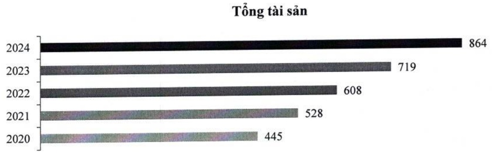
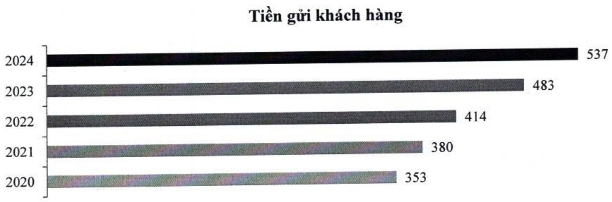

yếu lên nền tảng điện toán đám mây (private cloud) giúp nâng cao năng suất và giảm thiểu chi phí. Ngoài ra, ACB cũng là một trong số ít các ngân hàng đầu tiên triển khai thanh toán qua thế bằng Apple Pay và Google Pay, giúp tăng tính an toàn, linh hoạt và liền mạch cho trải nghiệm tiêu dùng của khách hàng. Ngày 27/10/2023, ACB là ngân hàng đầu tiên tại Việt Nam công bố Báo cáo riêng về ESG 2022. ACB đã hai lần liên tiếp được xướng tên trong tốp 50 doanh nghiệp phát triển bền vững (Top 50 Corporate Sustainability Awards).

Năm 2024, ACB đạt mức tăng trưởng tín dụng 19,1%, cao nhất trong gần một thập kỷ. Đặc biệt, tín dụng doanh nghiệp tăng mạnh 25%, phù hợp với định hướng phát triển cân bằng giữa mảng bán lẻ và mảng doanh nghiệp lớn; tiếp tục khảng định vị thế vững chắc là ngân hàng bán lẻ hàng đầu trên thị trường. ACB lần đầu tiên được xếp hạng tín nhiệm bởi các tổ chức trong nước. Theo đó, Fiinratings đã xếp hạng ACB ở mức cao nhất trong số các ngân hàng tham gia xếp hạng tín nhiệm, với xếp hạng Tín nhiệm dài hạn nhà phát hành đạt mức “AA+” và triển vọng “Ôn định”. 2024 cũng là năm trong giai đoạn 2019 – 2024 đánh dấu ACB đầy mạnh chuyển đổi số, phát triển Ngân hàng số ACB ONE thành kênh kinh doanh quan trọng với nhiều sản phẩm và dịch vụ đa dạng, hướng đến mục tiêu mở rộng các kênh huy động và nâng cao trải nghiệm khách hàng. Kết quả, ACB ghi nhận tăng trưởng ấn tượng với số lượng giao dịch trực tuyến (online) tăng 98% và giá trị giao dịch tăng 75%.

#### 1.1.3 Các biểu đồ tăng trưởng (Số liệu hợp nhất của Tập đoàn)

### a. Tổng tài sản (nghin tỷ đồng)

b. Tiền gửi khách hàng (nghìn tỷ đồng)

