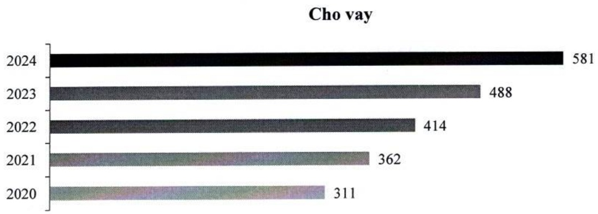
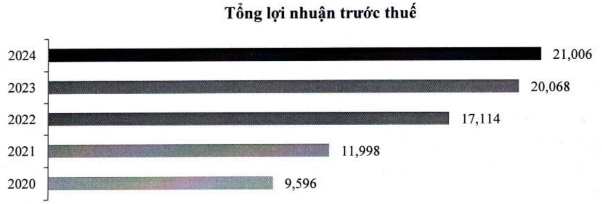

### c. Tổng dư nợ cho vay (nghin tỷ đồng)

### d. Tổng lợi nhuận trước thuế (tỷ đồng)

## 1.2.Ngành nghề và địa bàn kinh doanh

### 1.2.1 Ngành nghề kinh doanh

Xin xem Phần 1. (a) “Thành lập và hoạt động” trong Báo cáo tài chính hợp nhất năm 2024.

### 1.2.2 Địa bàn kinh doanh

Đến cuối năm 2024, ACB có 388 CN và PGD hoạt động tại 49 tỉnh thành trong cả nước. Các địa bàn hoạt động kinh doanh chiếm trên 10% tổng doanh thu của ACB trong hai năm gần nhất bao gồm Thành phố Hồ Chí Minh, Hà Nội và Đông Nam Bộ.

## 1.3. Mô hình quản trị, tổ chức kinh doanh và bộ máy quản lý

### 1.3.1 Mô hình quản trị

- Mô hình quản trị của ACB gồm có: Đại hội đồng cổ đông, HĐQT, BKS, và Tổng giám đốc (theo khoản 1 Điều 29 Điều lệ ACB.)

- Người đại diện theo pháp luật là Tổng giám đốc (theo khoản 10 Điều 2 Điều lệ ACB).