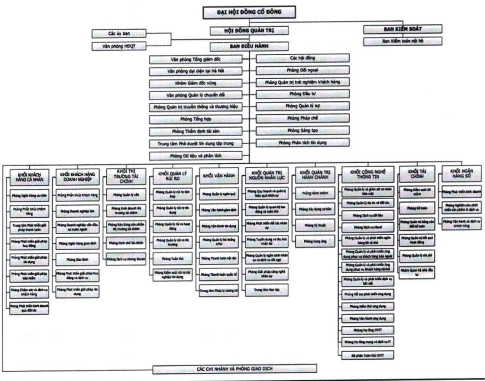

### 1.3.2 Cơ cấu bộ máy quản lý

BĐH gồm có Tổng giám độc, các Phó Tổng giám độc và Kế toán trưởng.

- ACB gồm có các đơn vị Hội sở, hệ thống CN và PGD, và Văn phòng đại diện Ngân hàng TMCP Á Châu tại Hà Nội. Các đơn vị Hội sở bao gồm 10 khối và 16 phòng, ban, trung tâm và văn phòng.

### 1.3.3 Sơ đồ tổ chức

### 1.3.4 Các công ty con

(Xin xem mục 2.3.2. "Các công ty con, công ty liên kết" ở Chương 2.)

## 1.4.Định hướng phát triển

#### 1.4.1 Các mục tiêu về tài chính chủ yếu năm 2025

Tổng tài sản tăng 14%, ước đạt 984.967 tỷ đồng.

Tiền gửi khách hàng (gồm giấy tờ có giá) tăng 14%, ước đạt 728.409 tỷ đồng.

- Cho vay khách hàng tăng 16% (*), ước đạt 673.596 tỷ đồng.

Tổng lợi nhuận trước thuế khoảng 23.000 tỷ đồng.