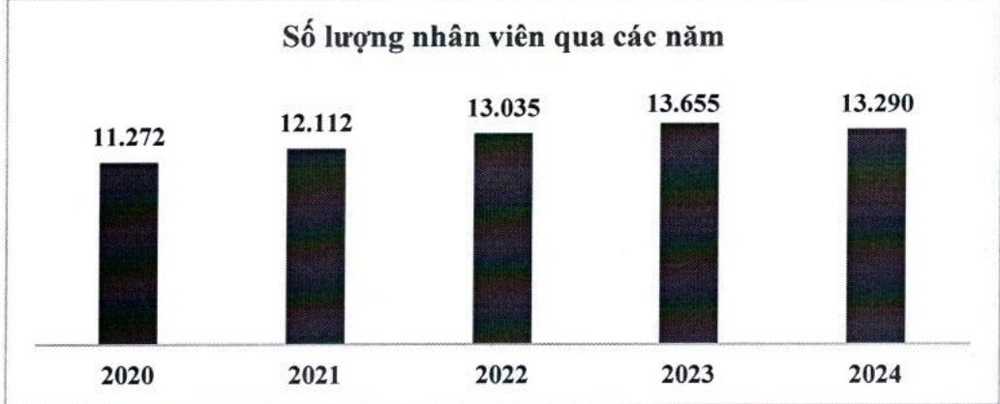
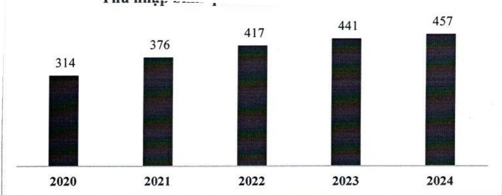

Được bổ nhiệm Phó Tổng giám đốc năm 2023.

Tốt nghiệp cử nhân quản trị kinh doanh và thực sĩ kinh tế của Trường Đại học Kinh tế TP. Hồ Chí Minh.

##### Bà Dương Thị Nguyệt, Kế toán trưởng

Vào ACB năm 1997.

- Trải qua các vị trí sau: Trường bộ phận Tác nghiệp ngân quỹ (2013 – 2016), Phó Phòng Kế toán (2016-2023)

Được bổ nhiệm Kế toán trưởng năm 2023.

Tốt nghiệp cử nhân kinh tế của Trường Đại học Kinh tế chuyên ngành tài chính - ngân hàng, cử nhân ngữ văn Anh của Trường Đại học Khoa học xã hội và nhân văn.

### c. Những thay đổi trong Ban điều hành

Trong năm 2024, Ngân hàng không có thay đổi nào trong Ban điều hành.

### 2.2.2 Số lượng cán bộ nhân viên, tóm tắt chính sách và thay đổi trong chính sách đối với người lao động

a. Số lượng cán bộ nhân viên 2020 - 2024 (theo BCTC hợp nhất)

Tính đến ngày 31 tháng 12 năm 2024, ACB có 13.290 nhân viên.

Thu nhập bình quân của nhân viên trong năm 2024 là 457 triệu đồng.

Thu nhập bình quân nhân viên qua các năm

