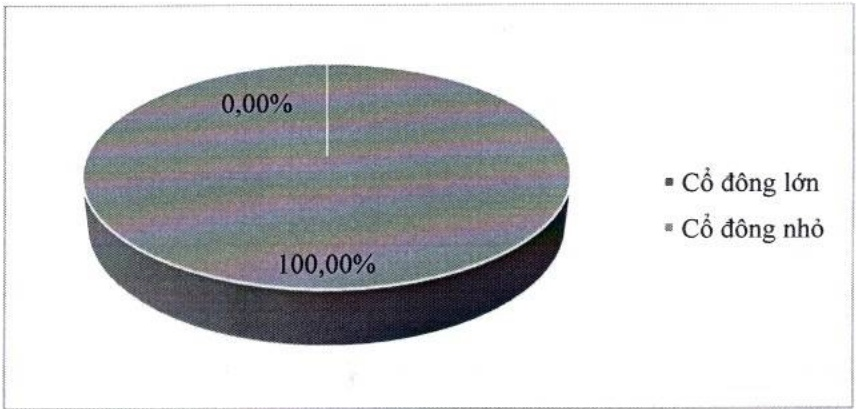
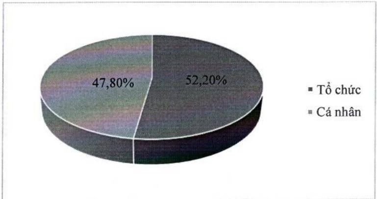

b. Theo tiêu chí cổ động tổ chức và cổ động cá nhân

<table border=1 style='margin: auto; word-wrap: break-word;'><tr><td style='text-align: center; word-wrap: break-word;'></td><td style='text-align: center; word-wrap: break-word;'>Số lượng cổ đông</td><td style='text-align: center; word-wrap: break-word;'>Số lượng cổ phần</td><td style='text-align: center; word-wrap: break-word;'>Tỷ lệ sở hữu cổ phần (%)</td></tr><tr><td style='text-align: center; word-wrap: break-word;'>Tổ chức</td><td style='text-align: center; word-wrap: break-word;'>496</td><td style='text-align: center; word-wrap: break-word;'>2.331.815.723</td><td style='text-align: center; word-wrap: break-word;'>52,20</td></tr><tr><td style='text-align: center; word-wrap: break-word;'>Cá nhân</td><td style='text-align: center; word-wrap: break-word;'>75.961</td><td style='text-align: center; word-wrap: break-word;'>2.134.842.189</td><td style='text-align: center; word-wrap: break-word;'>47,80</td></tr><tr><td style='text-align: center; word-wrap: break-word;'>Tổng cộng</td><td style='text-align: center; word-wrap: break-word;'>76.457</td><td style='text-align: center; word-wrap: break-word;'>4.466.657.912</td><td style='text-align: center; word-wrap: break-word;'>100,00</td></tr></table>

c. Theo tiêu chí cổ động trong nước và cổ động nước ngoài

<table border=1 style='margin: auto; word-wrap: break-word;'><tr><td style='text-align: center; word-wrap: break-word;'></td><td style='text-align: center; word-wrap: break-word;'>Số lượng cổ đông</td><td style='text-align: center; word-wrap: break-word;'>Số lượng cổ phần</td><td style='text-align: center; word-wrap: break-word;'>Tỷ lệ sở hữu cổ phần (%)</td></tr><tr><td style='text-align: center; word-wrap: break-word;'>Cổ đông trong nước</td><td style='text-align: center; word-wrap: break-word;'>76.229</td><td style='text-align: center; word-wrap: break-word;'>3.126.665.421</td><td style='text-align: center; word-wrap: break-word;'>70,00</td></tr><tr><td style='text-align: center; word-wrap: break-word;'>Cổ đông nước ngoài</td><td style='text-align: center; word-wrap: break-word;'>228</td><td style='text-align: center; word-wrap: break-word;'>1.339.992.491</td><td style='text-align: center; word-wrap: break-word;'>30,00</td></tr><tr><td style='text-align: center; word-wrap: break-word;'>Tổng cộng</td><td style='text-align: center; word-wrap: break-word;'>76.457</td><td style='text-align: center; word-wrap: break-word;'>4.466.657.912</td><td style='text-align: center; word-wrap: break-word;'>100,00</td></tr></table>