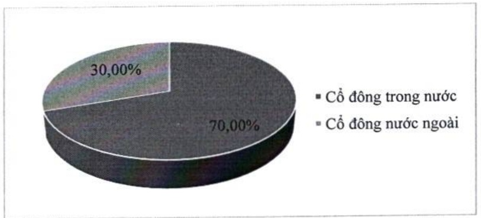
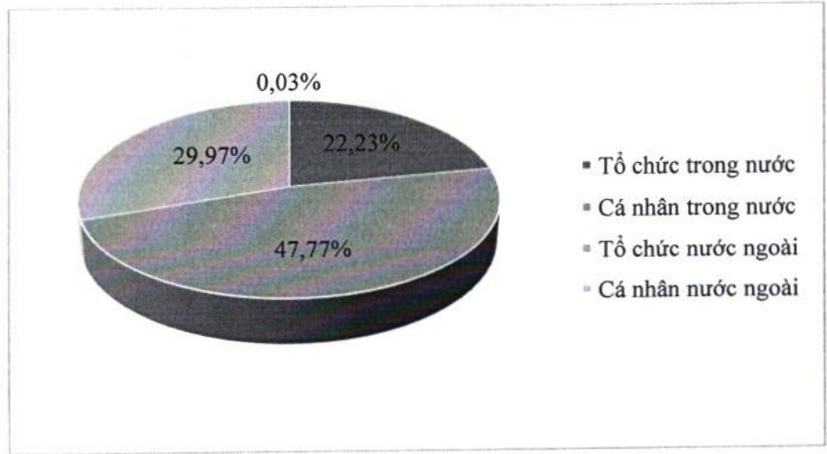

d. Theo tiêu chí cổ động trong nước và cổ động nước ngoài, cổ động tổ chức và cổ động cá nhân

<table border=1 style='margin: auto; word-wrap: break-word;'><tr><td style='text-align: center; word-wrap: break-word;'></td><td style='text-align: center; word-wrap: break-word;'>Số lượng cổ đông</td><td style='text-align: center; word-wrap: break-word;'>Số lượng cổ phần</td><td style='text-align: center; word-wrap: break-word;'>Tỷ lệ sở hữu cổ phần (%)</td></tr><tr><td style='text-align: center; word-wrap: break-word;'>Cổ đông trong nước (1)</td><td style='text-align: center; word-wrap: break-word;'>76.229</td><td style='text-align: center; word-wrap: break-word;'>3.126.665.421</td><td style='text-align: center; word-wrap: break-word;'>70,00</td></tr><tr><td style='text-align: center; word-wrap: break-word;'>- Tổ chức</td><td style='text-align: center; word-wrap: break-word;'>308</td><td style='text-align: center; word-wrap: break-word;'>992.953.362</td><td style='text-align: center; word-wrap: break-word;'>22,23</td></tr><tr><td style='text-align: center; word-wrap: break-word;'>- Cá nhân</td><td style='text-align: center; word-wrap: break-word;'>75.921</td><td style='text-align: center; word-wrap: break-word;'>2.133.712.059</td><td style='text-align: center; word-wrap: break-word;'>47,77</td></tr><tr><td style='text-align: center; word-wrap: break-word;'>Cổ đông nước ngoài (2)</td><td style='text-align: center; word-wrap: break-word;'>228</td><td style='text-align: center; word-wrap: break-word;'>1.339.992.491</td><td style='text-align: center; word-wrap: break-word;'>30,00</td></tr><tr><td style='text-align: center; word-wrap: break-word;'>- Tổ chức</td><td style='text-align: center; word-wrap: break-word;'>188</td><td style='text-align: center; word-wrap: break-word;'>1.338.862.361</td><td style='text-align: center; word-wrap: break-word;'>29,97</td></tr><tr><td style='text-align: center; word-wrap: break-word;'>- Cá nhân</td><td style='text-align: center; word-wrap: break-word;'>40</td><td style='text-align: center; word-wrap: break-word;'>1.130.130</td><td style='text-align: center; word-wrap: break-word;'>0,03</td></tr><tr><td style='text-align: center; word-wrap: break-word;'>Cộng (1) &amp; (2)</td><td style='text-align: center; word-wrap: break-word;'>76.457</td><td style='text-align: center; word-wrap: break-word;'>4.466.657.912</td><td style='text-align: center; word-wrap: break-word;'>100,00</td></tr></table>

### e. Cổ đông lớn nước ngoài

Tỷ lệ sở hữu nước ngoài tối đa tại NHTM là 30% và hiện nay tỷ lệ này tại ACB là 30%.