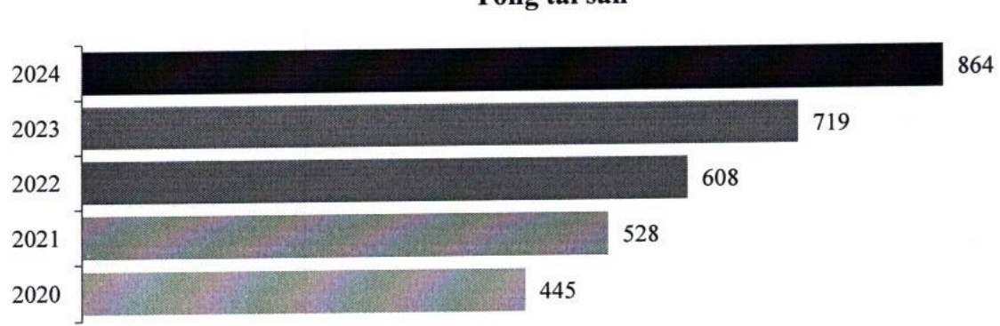

## 3.2 Tình hình tài chính

#### 3.2.1 Phân tích bảng cân đối kế toán

### a. Tổng tài sản

Tổng tài sản hợp nhất tăng trưởng đều đặn trong 5 năm liên tiếp từ 2020 đến 2024, với tổc độ tăng trưởng bình quân là 18%. Cuối năm 2024, tổng tài sản đạt 864 nghìn tỷ đồng, tăng hơn 20% so cuối năm 2023, và vượt 7% kế hoạch.

Tổng tài sản

Tài sản sinh lời trong cơ cấu tài sản tiếp tục tăng, đạt đến 97% tổng tài sản; riêng nợ nhóm 1 chiếm đến khoảng 65%.