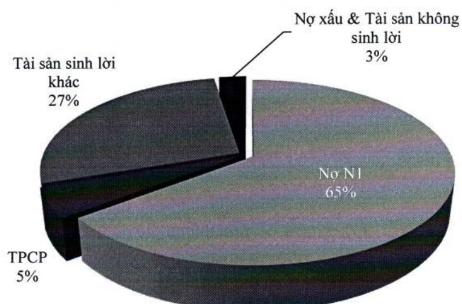

### b. Vốn

Đến cuối năm 2024, tỷ lệ an toàn vốn hợp nhất ở mức 11,82%, cao hơn mức quy định tối thiểu 8%. Tổng vốn tự có đạt gần 80 nghìn tỷ đồng, tăng hơn 17% so với năm 2023.

<table border=1 style='margin: auto; word-wrap: break-word;'><tr><td style='text-align: center; word-wrap: break-word;'>Chỉ tiêu</td><td style='text-align: center; word-wrap: break-word;'>2020</td><td style='text-align: center; word-wrap: break-word;'>2021</td><td style='text-align: center; word-wrap: break-word;'>2022</td><td style='text-align: center; word-wrap: break-word;'>2023</td><td style='text-align: center; word-wrap: break-word;'>2024</td></tr><tr><td style='text-align: center; word-wrap: break-word;'>An toàn vốn (%)</td><td style='text-align: center; word-wrap: break-word;'>11,06</td><td style='text-align: center; word-wrap: break-word;'>11,23</td><td style='text-align: center; word-wrap: break-word;'>12,80</td><td style='text-align: center; word-wrap: break-word;'>12,48</td><td style='text-align: center; word-wrap: break-word;'>11,82</td></tr><tr><td style='text-align: center; word-wrap: break-word;'>An toàn vốn cấp 1 (%)</td><td style='text-align: center; word-wrap: break-word;'>10,37</td><td style='text-align: center; word-wrap: break-word;'>11,26</td><td style='text-align: center; word-wrap: break-word;'>12,69</td><td style='text-align: center; word-wrap: break-word;'>12,94</td><td style='text-align: center; word-wrap: break-word;'>12,29</td></tr><tr><td style='text-align: center; word-wrap: break-word;'>Tổng tài sản có rủi ro (tỷ đồng)</td><td style='text-align: center; word-wrap: break-word;'>338.337</td><td style='text-align: center; word-wrap: break-word;'>395.018</td><td style='text-align: center; word-wrap: break-word;'>457.049</td><td style='text-align: center; word-wrap: break-word;'>545.026</td><td style='text-align: center; word-wrap: break-word;'>675.593</td></tr><tr><td style='text-align: center; word-wrap: break-word;'>Vốn tự có (tỷ đồng)</td><td style='text-align: center; word-wrap: break-word;'>37.414</td><td style='text-align: center; word-wrap: break-word;'>44.374</td><td style='text-align: center; word-wrap: break-word;'>58.519</td><td style='text-align: center; word-wrap: break-word;'>68.029</td><td style='text-align: center; word-wrap: break-word;'>79.862</td></tr></table>

ACB luôn đảm bảo mức độ đủ vốn theo một số chuẩn mực quốc tế và theo quy định tại Thông tư số 13/2018/TT-NHNN quy định về hệ thống kiểm soát nội bộ, giúp nhà đầu tư và khách hàng yên tâm khi đầu tư và giao dịch với Ngân hàng. Trong các đánh giá về xếp hạng tín nhiệm của các tổ chức quốc tế cũng như trong nước, mức độ đủ vốn của ACB cũng luôn thuộc nhóm tiêu chí đạt mức điểm cao.

##### Các tỷ lệ an toàn trong hoạt động ngân hàng

ACB luôn đảm bảo tuân thủ và vượt các quy định về tỷ lệ an toàn thanh khoản theo quy định của NHNN. Cụ thể, tỷ lệ dự trữ thanh khoản luôn cao hơn quy định tối thiểu (10%), ở mức 14,94% vào cuối năm 2024. Tỷ lệ của nguồn vốn ngắn hạn được sử dụng để cho vay trung hạn và dài hạn thì thấp hơn nhiều so với mức quy định tối đa (30%), đạt 18,78%. Về