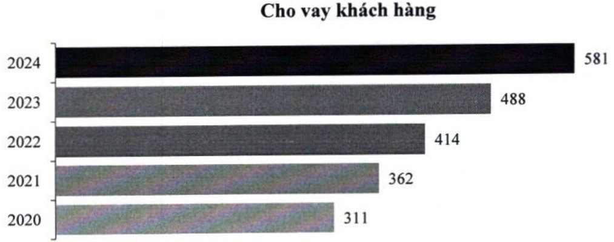

khả năng chi trả trong 30 ngày, đối với VND, tỷ lệ này ở mức 61,94%, cao hơn nhiều quy định tối thiểu 50%; còn đối với ngoại tệ khác, tỷ lệ này luôn ở mức cao.

<table border=1 style='margin: auto; word-wrap: break-word;'><tr><td style='text-align: center; word-wrap: break-word;'>Chi tiêu (%)</td><td style='text-align: center; word-wrap: break-word;'>2023</td><td style='text-align: center; word-wrap: break-word;'>2024</td><td style='text-align: center; word-wrap: break-word;'>Quy định</td></tr><tr><td style='text-align: center; word-wrap: break-word;'>Tỷ lệ dự trữ thanh khoản</td><td style='text-align: center; word-wrap: break-word;'>16,67</td><td style='text-align: center; word-wrap: break-word;'>14,94</td><td style='text-align: center; word-wrap: break-word;'>≥ 10</td></tr><tr><td style='text-align: center; word-wrap: break-word;'>Khả năng chi trả trong 30 ngày</td><td style='text-align: center; word-wrap: break-word;'></td><td style='text-align: center; word-wrap: break-word;'></td><td style='text-align: center; word-wrap: break-word;'></td></tr><tr><td style='text-align: center; word-wrap: break-word;'>VND</td><td style='text-align: center; word-wrap: break-word;'>66,07</td><td style='text-align: center; word-wrap: break-word;'>61,94</td><td style='text-align: center; word-wrap: break-word;'>≥ 50</td></tr><tr><td style='text-align: center; word-wrap: break-word;'>Ngoại tệ khác</td><td style='text-align: center; word-wrap: break-word;'>206,47</td><td style='text-align: center; word-wrap: break-word;'>197,95</td><td style='text-align: center; word-wrap: break-word;'>≥ 10</td></tr><tr><td style='text-align: center; word-wrap: break-word;'>Tỷ lệ của nguồn vốn ngắn hạn được sử dụng cho vay trung hạn và dài hạn</td><td style='text-align: center; word-wrap: break-word;'>17,30</td><td style='text-align: center; word-wrap: break-word;'>18,78</td><td style='text-align: center; word-wrap: break-word;'>≤ 30</td></tr><tr><td style='text-align: center; word-wrap: break-word;'>Tổng dư nợ cho vay/Tổng tiền gửi</td><td style='text-align: center; word-wrap: break-word;'>78,14</td><td style='text-align: center; word-wrap: break-word;'>78,01</td><td style='text-align: center; word-wrap: break-word;'>≤ 85</td></tr></table>

### d. Hoạt động tín dụng

Trong năm 2024, hoạt động tín dụng trở thành mảng cạnh tranh gay gắt giữa các ngân hàng. Trong bối cảnh đó, ACB vẫn tăng trưởng cao hơn bình quân ngành. Dự nợ cho vay đến cuối năm đạt 581 nghìn tỷ đồng, tăng 19,1% so với năm 2023. Cho vay nhất quán theo hướng cần trọng, với 98% khoản vay có tài sản đảm bảo và tỷ lệ cho vay trên giá trị tài sản bảo đảm (LTV) của danh mục khoảng 53%.

Tiếp tục đầy mạnh màng bán lẻ. Tín dụng khách hàng cá nhân vẫn là động lực tăng trưởng toàn hệ thống, với quy mô 373 nghìn tỷ đồng, tăng 15,8% so với năm 2023. Nhận thấy tiềm năng phát triển khách hàng doanh nghiệp, ACB đã gia tăng khai thác mảng này và đạt mức tăng trưởng cao nhất trong vòng 5 năm qua, ở mức 25%, và có mức tăng ròng tín dụng cao nhất trong lich sử.

### e. Chất lượng tín dụng