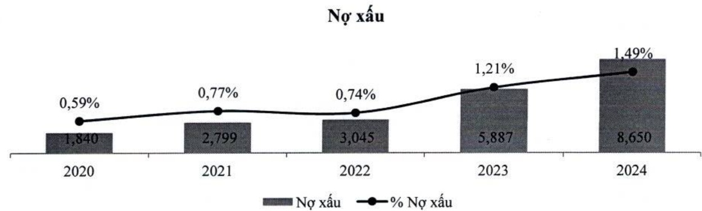
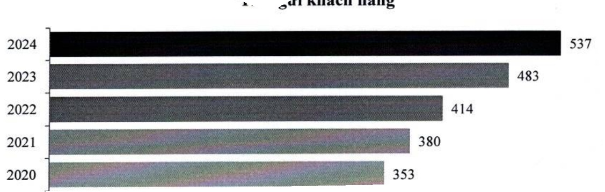

- ACB chủ động trong việc kiểm soát và xử lý nợ xấu. Trong bối cảnh tỷ lệ nợ xấu toàn ngành nói chung và tại ACB nói riêng có xu hướng tăng trên 1%, ở mức 1,49%, ACB vẫn có tỷ lệ nợ xấu ở mức thấp hàng đầu thị trường.

<table border=1 style='margin: auto; word-wrap: break-word;'><tr><td style='text-align: center; word-wrap: break-word;'></td><td style='text-align: center; word-wrap: break-word;'>2020</td><td style='text-align: center; word-wrap: break-word;'>2021</td><td style='text-align: center; word-wrap: break-word;'>2022</td><td style='text-align: center; word-wrap: break-word;'>2023</td><td style='text-align: center; word-wrap: break-word;'>2024</td></tr><tr><td style='text-align: center; word-wrap: break-word;'>Nợ nhóm 3-5 (tỷ đồng)</td><td style='text-align: center; word-wrap: break-word;'>1.840</td><td style='text-align: center; word-wrap: break-word;'>2.799</td><td style='text-align: center; word-wrap: break-word;'>3.045</td><td style='text-align: center; word-wrap: break-word;'>5.887</td><td style='text-align: center; word-wrap: break-word;'>8.650</td></tr><tr><td style='text-align: center; word-wrap: break-word;'>Tỷ lệ nợ nhóm 3-5/Tổng dư nợ cho vay (%)</td><td style='text-align: center; word-wrap: break-word;'>0,59</td><td style='text-align: center; word-wrap: break-word;'>0,77</td><td style='text-align: center; word-wrap: break-word;'>0,74</td><td style='text-align: center; word-wrap: break-word;'>1,21</td><td style='text-align: center; word-wrap: break-word;'>1,49</td></tr><tr><td style='text-align: center; word-wrap: break-word;'>Dự phòng/Tổng nợ xấu (%)</td><td style='text-align: center; word-wrap: break-word;'>160</td><td style='text-align: center; word-wrap: break-word;'>209</td><td style='text-align: center; word-wrap: break-word;'>159</td><td style='text-align: center; word-wrap: break-word;'>91</td><td style='text-align: center; word-wrap: break-word;'>78</td></tr></table>

### f. Hoạt động huy động vốn

- Trong bối cảnh huy động vốn của nền kinh tế chỉ tăng khoảng 9% thì hoạt động nhận tiền gửi từ khách hàng tăng trưởng 11%, đạt 537 nghìn tỷ đồng, đảm bảo nguồn vốn cần thiết tài trợ cho các hoạt động sinh lời của ACB luôn ổn định.

Tiền gửi khách hàng

ACB có ưu thế về ngân hàng bán lẻ; tỷ trọng tiền gửi từ khách hàng cá nhân lên đến gần 80% tổng tiền gửi. Trong năm 2024, tỷ trọng tiền gửi không kỳ hạn trên tổng tiền gửi cải thiện so với năm 2023, đạt mức 23%.