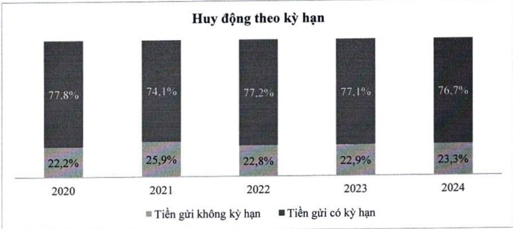

### g. Vốn chủ sở hữu

Vốn chủ sở hữu tăng 18% so với năm 2023 và đạt hơn 83 nghìn tỷ đồng. Trong năm, ACB chỉ trả cỗ tức cho cỗ đồng bằng tiền mặt với tỷ lệ 10% và cỗ tức bằng cỗ phiếu với tỷ lệ 15%, do đó vốn điều lệ tăng tương ứng 15% so với năm 2023.

ĐVT: Tỷ đồng

<table border=1 style='margin: auto; word-wrap: break-word;'><tr><td style='text-align: center; word-wrap: break-word;'>Chi tiêu</td><td style='text-align: center; word-wrap: break-word;'>2023</td><td style='text-align: center; word-wrap: break-word;'>2024</td><td style='text-align: center; word-wrap: break-word;'>% tăng giảm</td></tr><tr><td style='text-align: center; word-wrap: break-word;'>Vốn điều lệ</td><td style='text-align: center; word-wrap: break-word;'>38.841</td><td style='text-align: center; word-wrap: break-word;'>44.667</td><td style='text-align: center; word-wrap: break-word;'>15</td></tr><tr><td style='text-align: center; word-wrap: break-word;'>Thặng dư vốn cổ phần</td><td style='text-align: center; word-wrap: break-word;'>272</td><td style='text-align: center; word-wrap: break-word;'>272</td><td style='text-align: center; word-wrap: break-word;'>0</td></tr><tr><td style='text-align: center; word-wrap: break-word;'>Cổ phiếu quỹ</td><td style='text-align: center; word-wrap: break-word;'>-</td><td style='text-align: center; word-wrap: break-word;'>-</td><td style='text-align: center; word-wrap: break-word;'>0</td></tr><tr><td style='text-align: center; word-wrap: break-word;'>Quỹ của TCTD</td><td style='text-align: center; word-wrap: break-word;'>11.557</td><td style='text-align: center; word-wrap: break-word;'>14.790</td><td style='text-align: center; word-wrap: break-word;'>28</td></tr><tr><td style='text-align: center; word-wrap: break-word;'>Chênh lệch tỷ giá</td><td style='text-align: center; word-wrap: break-word;'>-</td><td style='text-align: center; word-wrap: break-word;'>-</td><td style='text-align: center; word-wrap: break-word;'>0</td></tr><tr><td style='text-align: center; word-wrap: break-word;'>Lợi nhuận chưa phân phối</td><td style='text-align: center; word-wrap: break-word;'>20.286</td><td style='text-align: center; word-wrap: break-word;'>23.734</td><td style='text-align: center; word-wrap: break-word;'>17</td></tr><tr><td style='text-align: center; word-wrap: break-word;'>Tổng vốn chủ sở hữu</td><td style='text-align: center; word-wrap: break-word;'>70.956</td><td style='text-align: center; word-wrap: break-word;'>83.462</td><td style='text-align: center; word-wrap: break-word;'>18</td></tr></table>

### 3.2.2 Phân tích kết quả kinh doanh

### a. Thu nhập

Lợi nhuận trước thuế toàn Tập đoàn là 21.006 tỷ đồng, tăng 5% so với năm 2023 và hoàn thành 95% kế hoạch.

Tổng thu nhập trong năm của ACB đạt 33.515 tỷ đồng, tăng 2,3% so với cùng kỳ, trong đó thu nhập lãi thuần tăng 11,4% và thu nhập ngoài lãi giảm 27%. Biên lãi ròng có sự sụt giảm