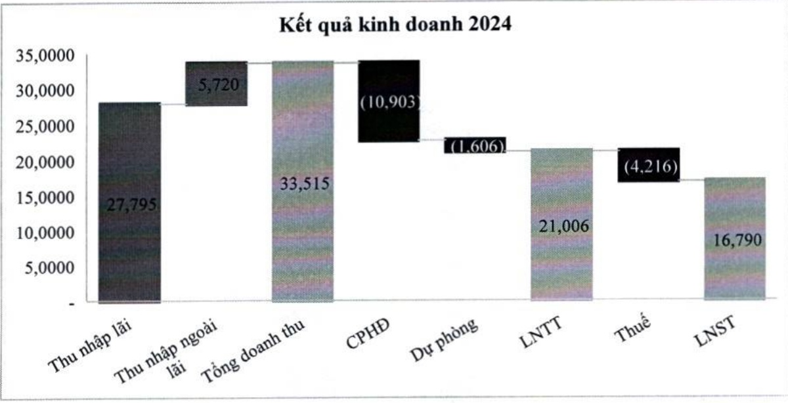
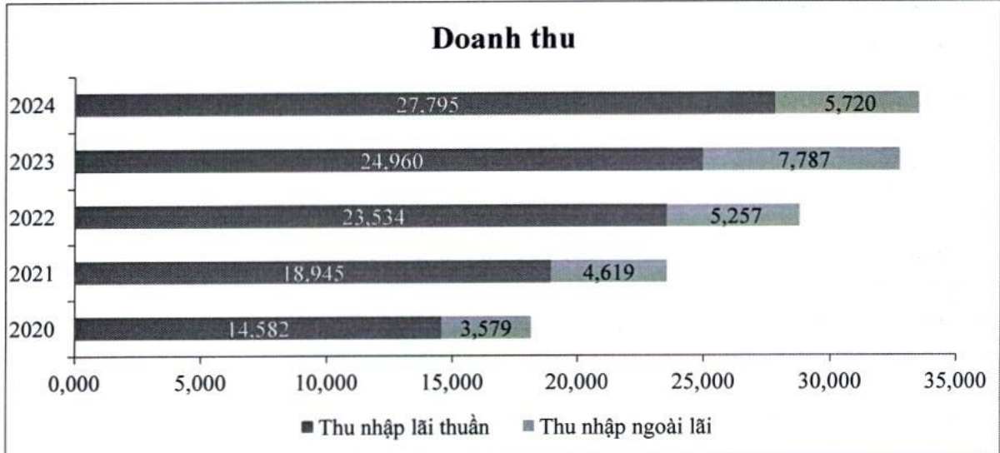

so với năm 2023, còn 3,62%, chủ yếu do mặt bằng lãi suất huy động tăng trở lại trong khi lãi suất cho vay văn duy trì ở mức thấp để hỗ trợ thúc đẩy tăng trưởng.

Thu nhập ngoài lãi năm 2024 giám 27%, đạt 5,7 nghìn tỷ đồng, chủ yếu do thị trường đầu tư chứng khoán kém thuận lợi. Tuy nhiên phí dịch vụ vấn ghi nhận mức tăng trưởng tích cực tăng 11%, nhờ các sản phẩm chủ lực như:

- Hoạt động kinh doanh thẻ tăng trưởng ấn tượng 39% so với năm 2023 và doanh số thanh toán tăng 25% so với cùng kỳ nhờ việc tăng trải nghiệm khách hàng, đổi mới sản phẩm dịch vụ, gia tăng các ưu đãi dành cho khách hàng như: ưu đãi phí giao dịch khi chi tiêu tại nước ngoài, phí trả góp tốt nhất thị trường, v.v.

Thanh toán quốc tế tăng trưởng 24% so với cùng kỳ trong bối cảnh tình hình xuất nhập khẩu tăng trưởng tốt.