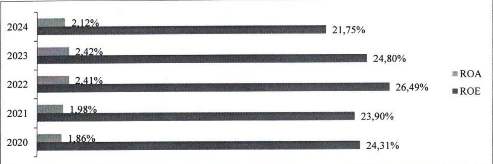
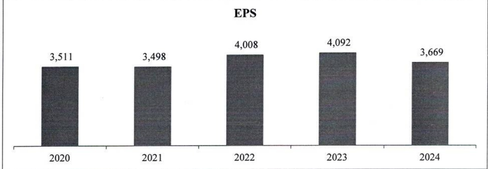

### e. Hoạt động ngân hàng số

Ngân hàng số ACB đã và đang ứng dụng những tiến bộ công nghệ để phát triển sản phẩm dịch vụ và tính năng trong năm 2024, tập trung vào 3 giá trị “An - Tiện - Lợi” xuyên suốt hành trình thiết kế trải nghiệm cho khách hàng:

AN: ACB ONE đã đầu tư các công nghệ tiên tiến nhất để tạo ra sự an tâm cho khách hàng khi trải nghiệm giao dịch trên không gian số của ACB. Cụ thể:

Áp dụng xác thực sinh trắc học khuôn mặt trong giao dịch trực tuyến;

- Chủ động loại bỏ các tài khoản không chính chủ;

- Tự động nhận diện và cảnh báo khi thiết bị di động có dấu hiệu bị tấn công từ mã độc dẫn đến nguy cơ mất tiền trong tài khoản, chủ động ngăn chặn khách hàng chuyển tiền đi khi có dấu hiệu giao dịch nghi ngờ.

TIỆN: ACB phát triển đồng bộ các giải pháp, tính năng gần gũi với nhu cầu và hoạt động tài chính hàng ngày theo phân khúc khách hàng để họ thuận tiện sử dụng và nhận được các lợi ích thiết thực. Cụ thể là:

Với khách hàng cá nhân: triển khai các tính năng mới như đặt vẻ máy bay trực tuyến, liên kết tài khoản ACB vào ví VETC, mua vẻ số Vietlott SMS, cải tiến sản phẩm tiền gửi trực tuyến (Online), tính năng video-call hỗ trợ khách hàng trong đăng ký sinh trắc học;

- Với khách hàng chủ cửa hàng: giải pháp quản lý cửa hàng cho chủ cửa hàng dễ dàng tạo tài khoản Lộc Phát, kinh doanh “rành tay” với tiện ích tự động thống kê doanh thu qua tài