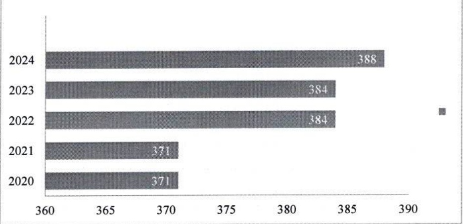
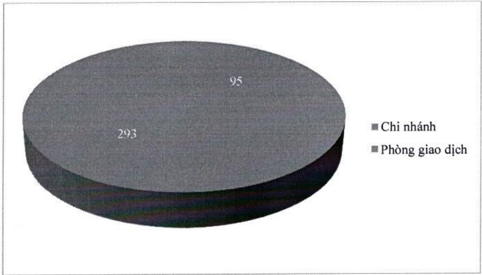

#### CHƯỜNG 8. MẠNG LƯỚI CHI NHÁNH VÀ PHÒNG GIAO DỊCH

Trong năm 2024, ACB đã nâng cấp 05 (năm) phòng giao dịch lên chi nhánh và mở mới 04 (bốn) phòng giao dịch. Tính đến cuối năm 2024, ACB có 93 CN và 295 PGD, tổng cộng là 388 đơn vị, hiện diện trên 49 tinh thành trong số 63 tinh thành cả nước. CN và PGD tập trung chủ yếu tại TP. Hồ Chí Minh và Hà Nội.

Số lượng chi nhánh và phòng giao dịch trong 05 (năm) năm qua.

Số lượng chi nhánh và phòng giao dịch qua các năm

Số lượng chi nhánh và phòng giao dịch cuối năm 2024

