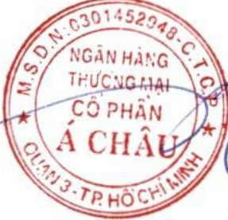

Với những đóng góp qua các sáng kiến phát triển cộng đồng, ACB tiếp tục nhận các giải thường danh giá như:

Ngân hàng có trách nhiệm xã hội tốt nhất Việt Nam 2024 do Global Banking and Finance Review bình chọn.

- Top 50 Doanh nghiệp phát triển bền vững 2024 do Tạp chí Nhịp Cầu Đầu Tư trao tặng.

9.9 Báo cáo liên quan đến hoạt động thị trường vốn xanh theo hướng dẫn của Ủy ban chứng khoán Nhà nước

Không áp dụng do Ngân hàng chưa huy động vốn từ thị trường vốn xanh.

#### CHƯƠNG 10. BÁO CÁO TÀI CHÍNH

## 10.1 Ý kiến kiểm toán

Xin xem Báo cáo kiểm toán độc lập của Công ty TNHH KPMG (Việt Nam) gửi cổ đông Ngân hàng TMCP Á Châu trong Báo cáo tài chính hợp nhất năm 2024 ký ngày 24 tháng 02 năm 2025.

10.2 Báo cáo tài chính được kiểm toán

Xin xem Báo cáo tài chính đính kèm.

TP. Hồ Chí Minh, ngày 24 tháng 3 năm 2025

NGƯỜI ĐẠI DIỆN THEO PHÁP LUẬT

Từ Tiến Phát

Nơi nhận:

NHNN - Chi nhánh Khu vực 2;

- Ủy ban Chứng khoán Nhà nước;

Sở GDCK TP. Hồ Chí Minh.

Đính kèm:

Báo cáo tài chính kiểm toán ACB năm 2024 (hợp nhất và riêng).