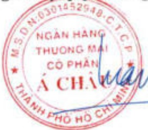

# NGÂN HÀNG TMCP Á CHÂU Số: 5185 /CV-VPHĐQT.26

# CỘNG HÒA XÃ HỘI CHỦ NGHĨA VIỆT NAM Độc lập - Tự do - Hạnh phúc

TP. Hồ Chí Minh, ngày 19 tháng 3 năm 2026

#### CÔNG BÓ THÔNG TIN ĐỊNH KỸ

Kính gửi: - Ủy ban Chứng khoán Nhà nước

- Sở Giao dịch Chứng khoản TP. Hồ Chí Minh

1. Tên tổ chức: NGÂN HÀNG TMCP Á CHÂU

- Mã chúng khoản: ACB

Địa chỉ: 442 Nguyễn Thị Minh Khai, Phường Bàn Cờ, TP. Hồ Chí Minh.

Điện thoại liên hệ: (+84) (028) 3929 0999

2. Nội dung thông tin công bố:

Ngày 19/3/2026, Hội đồng quản trị Ngân hàng TMCP Á Châu ban hành Nghị quyết số 874/TCQĐ-HĐQT.26 về Báo cáo thường niên của Ngân hàng TMCP Á Châu năm 2025.

3. Thông tin này đã được công bố trên trang thông tin điện tử của Ngân hàng vào ngày 19/3/2026 tại đường dẫn https://acb.com.vn/nha-dau-tu.

Chúng tôi xin cam kết các thông tin công bố trên đây là đúng sự thật và hoàn toàn chịu trách nhiệm trước pháp luật về nội dung các thông tin đã công bố.

Nơi nhận:

Như trên;

Đại diện tổ chức

Người ủy quyền công bố thông tin

- Luu: VPHBQT, VPTGB.

Định kèm:

- Nghị quyết số 874/TCQĐ-HDQT.26 ngày 19/3/2026.

Dàm Văn Cuẩn

PHỐ TỔNG GIẢM ĐỐC