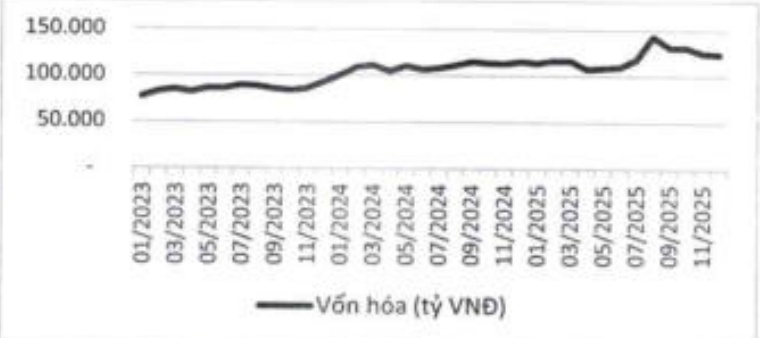

Toàn bộ tài liệu dành cho nhà đầu tư đều được cung cấp song ngữ Việt - Anh và công khai trên website của Ngân hàng tại mục Nhà đầu tư, thể hiện cam kết mạnh mẽ của ACB trong việc đảm bảo tính minh bạch và công bằng trong việc tiếp cận thông tin của tất cả cổ đồng và các các bên hữu quan trong và ngoài nước.

Năm 2025, Bộ phận IR của ACB duy trì việc thực hiện khảo sát giá mức độ hài lòng của nhà đầu tư đối với các buổi công bố kết quả kinh doanh hàng quỷ của ACB. Kết quả khảo sát nhiều năm liền ghi nhận tỷ lệ phản hồi tích cực, đặc biệt về: Recap note tóm tắt được gửi ngay sau buổi hợp, sự tham gia của TGB và lãnh đạo cấp cao, cùng phần Q&A trực diện, chi tiết. Điều này tiếp tục khảng định sự chuyên nghiệp và uy tín của ACB trong hoạt động Quan hệ nhà đầu tư.

#### >60%: tốc độ gia tăng vốn hóa thị trường của ACB trong 3 năm gần đây

Trong giai đoạn từ đầu tháng 1/2023 đến cuối tháng 12/2025, vốn hóa thị trường của ACB tăng từ 76.668 tỷ đồng lên 123.280 tỷ đồng, tương ứng mức tăng khoảng 60,8%.

# 200+: số lượng nhà đầu tư và tổ chức phân tích mà ACB đã tiếp đón trong năm 2025

Trong năm 2025, ACB đã tổ chức đầy đủ các buổi hợp định kỳ hàng quý nhằm cấp nhất kịp thời tinh hình hoạt động và kết quả kinh doanh đến cổ động và các nhà phân tích. Bên cạnh đó, Ngân hàng đã tiếp đón hơn 200 nhà đầu tư và tổ chức phân tích thông qua hơn 70 tuổi làm việc tại Hội sở của ACB, đáp ứng nhanh chóng, hiệu quả nhu cầu thông tin và tăng cường đối thoại trực tiếp với công đồng nhà đầu tư và các nhà phân tích.

### 5.11.4.b Lịch sự kiện IR năm 2025

<table border=1 style='margin: auto; word-wrap: break-word;'><tr><td style='text-align: center; word-wrap: break-word;'>Thời gian</td><td style='text-align: center; word-wrap: break-word;'>Sự kiện</td></tr><tr><td style='text-align: center; word-wrap: break-word;'>09/01/2025</td><td style='text-align: center; word-wrap: break-word;'>Tham dự sự kiện J.P. Morgan’s ASEAN Financials Forum 2025 do J.P. Morgan tổ chức</td></tr><tr><td style='text-align: center; word-wrap: break-word;'>22/01/2025</td><td style='text-align: center; word-wrap: break-word;'>Tổ chức cuộc họp Cập nhất kết quả kinh doanh năm tài chính 2024 dành cho nhà đầu tư trong nước và quốc tế</td></tr><tr><td style='text-align: center; word-wrap: break-word;'>24/01/2025</td><td style='text-align: center; word-wrap: break-word;'>Tham dự hội nghị trực tuyến với các quỹ đầu tư đến từ Hoa Kỳ do Công ty Cổ phần Chứng khoán SSI tổ chức</td></tr><tr><td style='text-align: center; word-wrap: break-word;'>21/02/2025</td><td style='text-align: center; word-wrap: break-word;'>Tham dự sự kiện Investors on Vietnam tour do UBS tổ chức</td></tr><tr><td style='text-align: center; word-wrap: break-word;'>26/02/2025</td><td style='text-align: center; word-wrap: break-word;'>Tham gia Hội nghị đầu tư Vietnam Access Day 2025 do Công ty Cổ phần Chứng khoán Vietcap tổ chức</td></tr><tr><td style='text-align: center; word-wrap: break-word;'>06/3/2025</td><td style='text-align: center; word-wrap: break-word;'>Tiếp đoàn các nhà đầu tư đến từ Singapore, Hoa Kỳ, Hồng Kông và Vương Quốc Anh do CITIC CLSA tổ chức</td></tr><tr><td style='text-align: center; word-wrap: break-word;'>19/3/2025</td><td style='text-align: center; word-wrap: break-word;'>Tiếp đoàn các nhà đầu tư Nhật Bản do Công ty Cổ phần Chứng khoán Bảo Việt tổ chức</td></tr><tr><td style='text-align: center; word-wrap: break-word;'>08/4/2025</td><td style='text-align: center; word-wrap: break-word;'>Tổ chức ĐHDCĐ thường niên năm 2025</td></tr><tr><td style='text-align: center; word-wrap: break-word;'>24/4/2025</td><td style='text-align: center; word-wrap: break-word;'>Tổ chức cuộc họp Cập nhất kết quả kinh doanh năm Quý 1 năm 2025 dành cho nhà đầu tư trong nước và quốc tế</td></tr><tr><td style='text-align: center; word-wrap: break-word;'>14/6/2025</td><td style='text-align: center; word-wrap: break-word;'>Tham dự tọa đảm trong hội thảo “Chiến lược đầu tư trong bởi cảnh mới” do Công ty Cổ phần Chứng khoán Rồng Việt tổ chức</td></tr><tr><td style='text-align: center; word-wrap: break-word;'>18/6/2025</td><td style='text-align: center; word-wrap: break-word;'>Tham dự Emerging Việt Nam 2025 do Công ty Cổ phần Chứng khoán HSC tổ chức</td></tr><tr><td style='text-align: center; word-wrap: break-word;'>25/7/2025</td><td style='text-align: center; word-wrap: break-word;'>Tổ chức cuộc họp Cập nhất kết quả kinh doanh năm Quý 2 năm 2025 dành cho nhà đầu tư trong nước và quốc tế</td></tr><tr><td style='text-align: center; word-wrap: break-word;'>17/9/2025</td><td style='text-align: center; word-wrap: break-word;'>Tham dự sự kiện Vietnam Investor tour do J.P. Morgan tổ chức</td></tr><tr><td style='text-align: center; word-wrap: break-word;'>08/10/2025</td><td style='text-align: center; word-wrap: break-word;'>Tiếp đoàn các nhà đầu tư nước ngoài do UBS tổ chức</td></tr><tr><td style='text-align: center; word-wrap: break-word;'>10/10/2025</td><td style='text-align: center; word-wrap: break-word;'>Gặp gỡ và trao đổi các quỹ đầu tư trong nước do Công ty Cổ phần Chứng khoán Rồng Việt tổ chức</td></tr><tr><td style='text-align: center; word-wrap: break-word;'>16/10/2025</td><td style='text-align: center; word-wrap: break-word;'>Tiếp đoàn các nhà đầu tư Thái Lan do Công ty Chứng khoán KKP (Thái Lan) tổ chức</td></tr><tr><td style='text-align: center; word-wrap: break-word;'>23/10/2025</td><td style='text-align: center; word-wrap: break-word;'>Tổ chức cuộc họp Cập nhất kết quả kinh doanh năm Quý 3 năm 2025 dành cho nhà đầu tư trong nước và quốc tế</td></tr></table>