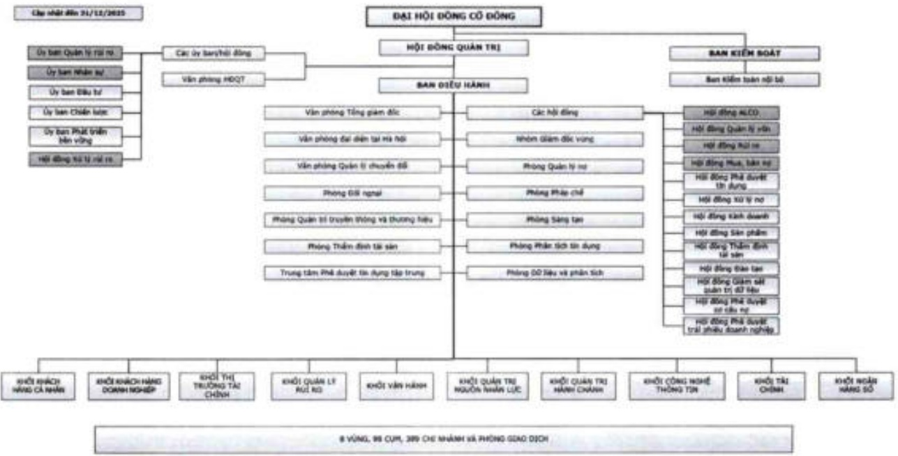
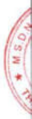

1.5.3. Công ty mẹ, công ty con, công ty liên kết, công ty liên doanh và doanh nghiệp/công ty có mục đích đặc biệt (SPE) / (SPV)

ACB không có công ty mẹ, công ty liên kết, công ty liên doanh hoặc doanh nghiệp/công ty có mục đích đặc biệt (SPE)/ (SPV).

ACB có các công ty con sau đây:

<table border=1 style='margin: auto; word-wrap: break-word;'><tr><td rowspan="2">TT</td><td rowspan="2">Tên công ty con</td><td rowspan="2">Địa chỉ</td><td rowspan="2">Giấy phép hoạt động/ Lĩnh vực kinh doanh chính</td><td rowspan="2">Vốn điều lệ thực góp</td><td colspan="2">Tỷ lệ sở hữu của ACB (%)</td><td colspan="2">% Tỷ lệ sở hữu của các công ty con của ACB</td></tr><tr><td style='text-align: center; word-wrap: break-word;'>31/12/2024</td><td style='text-align: center; word-wrap: break-word;'>31/12/2025</td><td style='text-align: center; word-wrap: break-word;'>31/12/2024</td><td style='text-align: center; word-wrap: break-word;'>31/12/2025</td></tr><tr><td style='text-align: center; word-wrap: break-word;'>1</td><td style='text-align: center; word-wrap: break-word;'>ACBS</td><td style='text-align: center; word-wrap: break-word;'>Tầng 3, Tòa nhà Léman Luxury, 117 Nguyễn Đinh Chiếu, Phường Xuân</td><td style='text-align: center; word-wrap: break-word;'>06/GPHDKD Chứng khoán</td><td style='text-align: center; word-wrap: break-word;'>11.000 tỷ đồng</td><td style='text-align: center; word-wrap: break-word;'>100%</td><td style='text-align: center; word-wrap: break-word;'>100%</td><td style='text-align: center; word-wrap: break-word;'>0%</td><td style='text-align: center; word-wrap: break-word;'>0%</td></tr><tr><td style='text-align: center; word-wrap: break-word;'></td><td style='text-align: center; word-wrap: break-word;'></td><td style='text-align: center; word-wrap: break-word;'>Hòa, TP. Hồ Chí Minh.</td><td style='text-align: center; word-wrap: break-word;'></td><td style='text-align: center; word-wrap: break-word;'></td><td style='text-align: center; word-wrap: break-word;'></td><td style='text-align: center; word-wrap: break-word;'></td><td style='text-align: center; word-wrap: break-word;'></td><td style='text-align: center; word-wrap: break-word;'></td></tr><tr><td style='text-align: center; word-wrap: break-word;'>2</td><td style='text-align: center; word-wrap: break-word;'>ACBA</td><td style='text-align: center; word-wrap: break-word;'>Lầu 8 Tòa nhà ACB, 444A - 446 Cách Mạng Tháng Tám, Phường Bản Cờ, TP. Hồ Chí Minh.</td><td style='text-align: center; word-wrap: break-word;'>0303539425 Quản lý nợ và khai thác tài sản</td><td style='text-align: center; word-wrap: break-word;'>505 tỷ đồng</td><td style='text-align: center; word-wrap: break-word;'>100%</td><td style='text-align: center; word-wrap: break-word;'>100%</td><td style='text-align: center; word-wrap: break-word;'>0%</td><td style='text-align: center; word-wrap: break-word;'>0%</td></tr><tr><td style='text-align: center; word-wrap: break-word;'>3</td><td style='text-align: center; word-wrap: break-word;'>ACBL</td><td style='text-align: center; word-wrap: break-word;'>Lầu 9, Tòa nhà ACB, 444A - 446 Cách Mạng Tháng Tám, Phường Bản Cờ, TP. Hồ Chí Minh.</td><td style='text-align: center; word-wrap: break-word;'>06/GP-NHNN Cho thuê tài chính</td><td style='text-align: center; word-wrap: break-word;'>500 tỷ đồng</td><td style='text-align: center; word-wrap: break-word;'>100%</td><td style='text-align: center; word-wrap: break-word;'>100%</td><td style='text-align: center; word-wrap: break-word;'>0%</td><td style='text-align: center; word-wrap: break-word;'>0%</td></tr><tr><td style='text-align: center; word-wrap: break-word;'>4</td><td style='text-align: center; word-wrap: break-word;'>ACBC</td><td style='text-align: center; word-wrap: break-word;'>Lầu 12 Tòa nhà ACB, 480 Nguyễn Thị Minh Khai, Phường Bản Cờ, TP. Hồ Chí Minh.</td><td style='text-align: center; word-wrap: break-word;'>41/UBCK-GP Quản lý quỹ</td><td style='text-align: center; word-wrap: break-word;'>1.050 tỷ đồng</td><td style='text-align: center; word-wrap: break-word;'>0%</td><td style='text-align: center; word-wrap: break-word;'>0%</td><td style='text-align: center; word-wrap: break-word;'>100%</td><td style='text-align: center; word-wrap: break-word;'>100%</td></tr></table>

