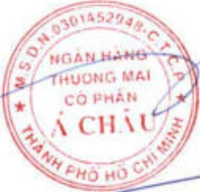

# CHƯỜNG 7. BÁO CÁO TÀI CHÍNH

## 7.1. Ý kiến kiểm toán

Xin xem Báo cáo kiểm toán độc lập của Công ty TNHH KPMG Việt Nam gửi cổ đồng Ngân hàng TMCP Á Châu trong Báo cáo tài chính hợp nhất năm 2025 ký ngày 24 tháng 02 năm 2026.

## 7.2. Báo cáo tài chính được kiểm toán

Xin xem Báo cáo tài chính định kèm.

Nơi nhận:

TP. Hồ Chí Minh, ngày 19 tháng 3 năm 2026

NGƯỜI ĐẠI DIỆN THEO PHÁP LUẬT

NHNN - Chi nhánh Khu vực 2;

- Ủy ban Chứng khoán Nhà nước;

Sở Giao dịch Chứng khoản TP. Hồ Chí Minh.

##### Định kèm:

Báo cáo tài chính kiểm toán ACB năm 2025 (hợp nhất và riêng.)

Cừ Ciến Phát TổNG GIẢM ĐỐC

