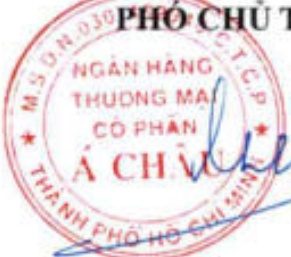

# NGHỊ QUYẾT Về Báo cáo thường niên của Ngân hàng TMCP Á Châu năm 2025

#### HỘI ĐỒNG QUẬN TRỊ NGÂN HÀNG TMCP Á CHÂU

- Căn cứ Luật Các tổ chức tín dụng số 32/2024/QH15 ngày 18/01/2024 và các văn bản sửa đổi, bổ sung;

- Căn cứ Thông tư số 96/2020/TT-BTC ngày 16/11/2020 về hướng dẫn công bố thông tin trên thị trường chứng khoản;

Căn cứ Công văn số 2555/NHNN-TTGSNH ngày 11/4/2023 của Ngân hàng Nhà nước Việt Nam về việc chấp thuận danh sách nhân sự dự kiến bầu làm thành viên Hội đồng quản trị, thành viên Ban kiếm soát nhiệm kỳ 2023 - 2028 của ACB; Nghị quyết số 944/TCQĐ-ĐHDCĐ.23 ngày 13/4/2023 về việc bầu thành viên Hội đồng quản trị nhiệm kỳ 2023 - 2028; và Nghị quyết số 954/TCQĐ-HĐQT.23 ngày 13/4/2023 về việc bầu các chức danh của Hội đồng quản trị nhiệm kỳ 2023 - 2028;

- Căn cứ Điều lệ Ngân hàng TMCP Á Châu;

Theo đề xuất của Giám đốc Văn phòng Hội đồng quản trị tại Tờ trình ngày 16/3/2026 về việc xem xét, phê duyệt báo cáo thường niên của Ngân hàng TMCP Á Châu năm 2025;

- Căn cứ Giấy uy quyền số 348/UQ-HDQT.26 ngày 13/3/2026;

- Căn cứ Biên bản kiểm phiếu số 27/CVNB-HDQT.26 ngày 19/3/2026.

#### QUYẾT NGHỊ

Điều 1. Thông qua toàn văn Báo cáo thường niên của Ngân hàng TMCP Á Châu năm 2025. (Đính kèm.)

Điều 2. Nghị quyết này có hiệu lực thi hành kế từ ngày ký.

Điều 3. Hội đồng quản tri, Ban Tổng giảm độc, các đơn vị và cá nhân có liên quan trong hệ thống Ngân hàng TMCP Á Châu chịu trách nhiệm thi hành Nghị quyết này.

Nơi nhận:

- Như Điều 3;

- Ban kiểm soát (để biết);

- Lưu: VP HĐQT, VP TGD.

Định kèm:

- Báo cáo thường niên của Ngân hàng TMCP A Châu năm 2025.

TM. HỘI ĐỒNG QUẢN TRỊ

TUỘ. CHỦ TỊCH

PHỐ CHỦ TỊCH

Nguyễn Thành Long