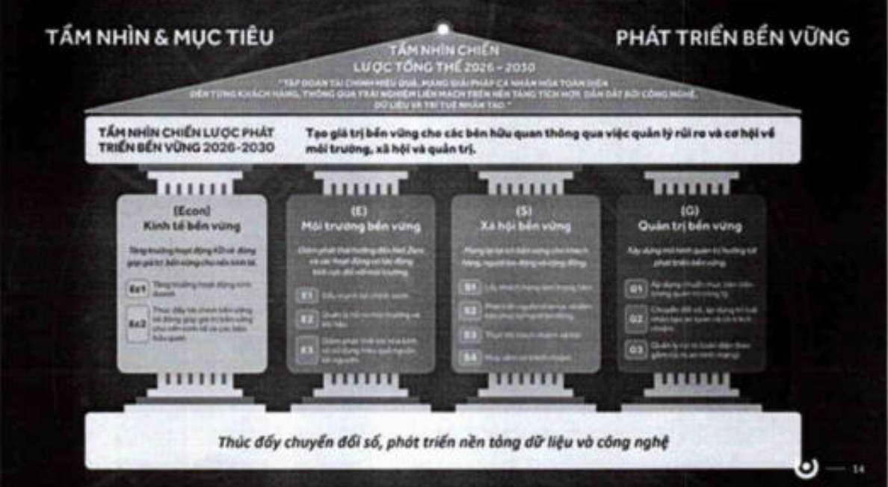

Các chương trình chính trong ngắn hạn và trung hạn về phát triển bền vững:

##### Môi trường:

Hoàn thiện và cấp nhất Khung tài chính bền vững, các quy trình thủ tục nội bộ có liên quan đến Tín dụng Xanh và Xã hội.

Thực hiện các sáng kiến tiết kiệm/giảm các yếu tố đầu vào chủ yếu và kế hoạch giảm tiêu thụ.

Chuyển đổi năng lượng sử dụng hướng đến giám phát thải.

Xã hội và công đồng:

Rà soát và thúc đẩy đa dạng, công bằng, hòa nhập (DEI) trong chiến lược phát triển nguồn nhân lực.

Đào tạo và nâng cao nhận thức về PTBV/ESG cho người lao động.

- Triển khai chiến lược CSR giai đoạn 2026-2030 theo hướng tạo giá trị chung.

## 1.8. Quản lý rủi ro

1.8.1. Hệ thống quản lý rủi ro

1.8.1.a Khung quản lý rủi ro

Ngân hàng thiết lập Khung quản lý rủi ro để quản lý các loại rủi ro phát sinh trong hoạt động ngân hàng, tuần thù quy định của NHNN, khẩu vị và chiến lược rủi ro của Ngân hàng.

Khung quản lý rùi ro bao gồm các nguyên tắc, tuyên bố khẩu vị rùi ro, hạn mức rùi ro, cấu trúc quản trị và mô hình vận hành, cùng hệ thống chính sách, quy định và hướng dẫn áp