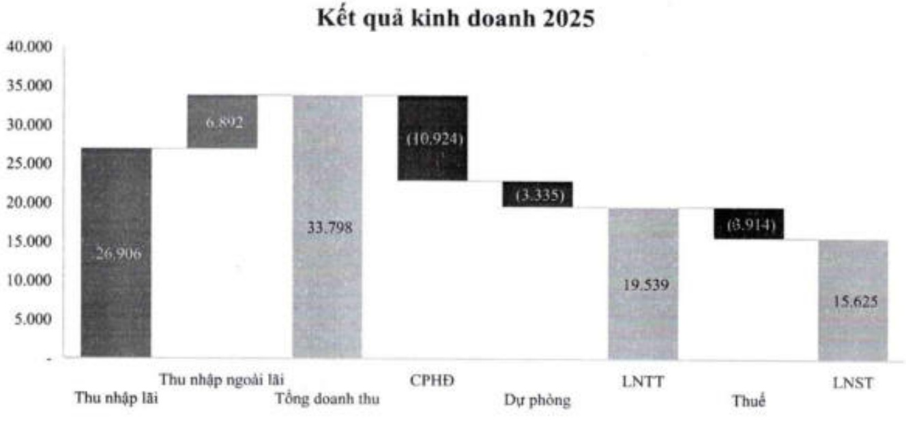
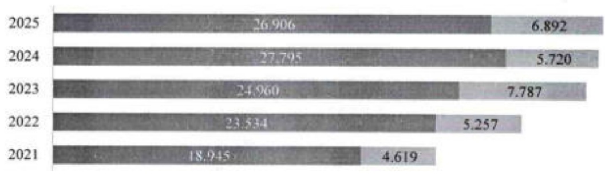

Doanh thu

Thu nhập lãi thuần

Thu nhập ngoài lãi

- Thu nhập ngoài lãi năm 2025 tăng 20,5%, đạt 6,9 nghìn tỷ đồng, chủ yếu nhờ tận dụng điều kiện thị trường thuận lợi: thu nhập từ hoạt động đầu tư tăng trường 33,9% và thu nhập từ hoạt động kinh doanh ngoại hối tăng 47,9% so với cùng kỳ. Bên cạnh đó, việc đầy mạnh thu hồi các khoản nợ xấu đã xử lý rủi ro giúp thu nhập từ hoạt động khác tăng mạnh 64,1%.

- Chi phí hoạt động của ACB tới cuối năm gần 11 nghìn tỷ đồng, tương đương so với năm trước, và tỷ lệ CIR 32,3% giảm nhẹ so với năm 2024 (32,5%).