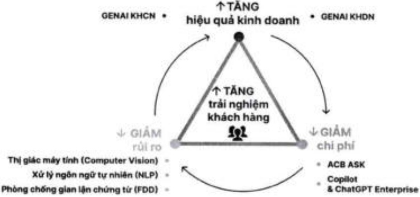

Tổng tài sản đạt 104% kế hoạch, tăng 18,7% so với đầu năm và chính thức vượt mốc 1 triệu tỷ đồng.

Quy mô huy động bao gồm phát hành giấy tờ có giá hoàn thành 99% kế hoạch đề ra, đạt hơn 718 nghìn tỷ đồng, tăng 12,4% so với đầu năm. Kết quả chưa đạt 100% mục tiêu phản ánh thực trạng kênh tiền gửi có xu hướng trở nên kém hấp dẫn hơn so với các kênh đầu tư khác.

- Cho vay khách hàng đạt 687 nghìn tỷ đồng, hoàn thành 102% kế hoạch và tăng 18,3% so với năm 2024, nhờ chiến lược cân bằng danh mục cho vay, tập trung vào các ngành trọng yếu của nền kinh tế, và đầy mạnh tăng trưởng cho vay doanh nghiệp trong bối cảnh nhu cầu tín dụng bán lẻ phục hồi chậm.

Tổng lợi nhuận trước thuế hoàn thành 85% kế hoạch năm chủ yếu nhờ đầy mạnh thu hồi nợ xấu và tận dụng điều kiện thị trường thuận lợi để gia tăng nguồn thu ngoài lãi trong bối cảnh thu nhập lãi giảm và Ngân hàng chủ động gia tăng trích lập dự phòng.

Tỷ lệ nợ xấu (nhóm 3 đến 5) trên dự nợ cho vay khách hàng được kiểm soát chặt chẽ, giảm xuống dưới 1% theo BCTC kiểm toán hợp nhất, thấp hơn đáng kể so với mức kế hoạch dưới 2% mà ĐHDCĐ đã thông qua.

2.1.3. Báo cáo hoạt động kinh doanh của một số các mảng hoạt động/đơn vị tiêu biểu

### 2.1.3.a Hoạt động chuyển đổi số

ACB là một trong những ngân hàng sớm tiếp cận và ứng dụng trí tuệ nhân tạo trong hoạt động ngân hàng. Trí tuệ nhân tạo tại ACB không được phát triển như một sáng kiến công nghệ độc lập, mà là một cấu phần chiến lược trong lộ trình năng cao năng lực cạnh tranh và hiệu quả hoạt động dài hạn của Ngân hàng.

Điểm nhấn năm 2025:

- AI được triển khai xuyên suốt các lĩnh vực trọng yếu