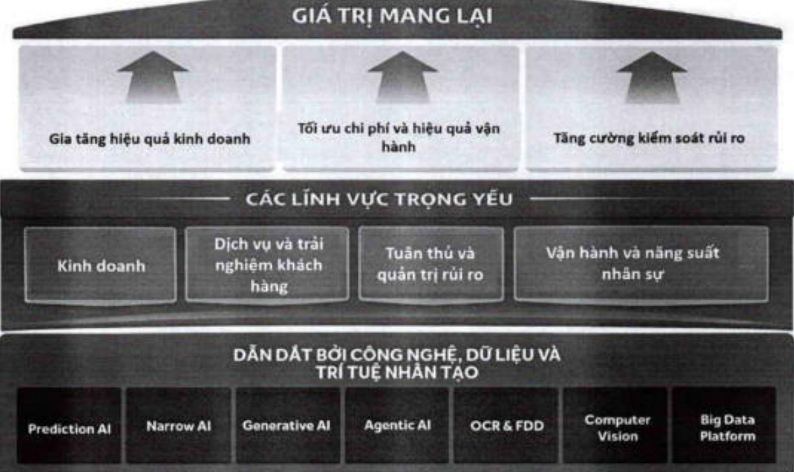

#### - AI chuyển mình từ vai trò hỗ trợ vận hành sang động lực tạo doanh thu trực tiếp

Năm 2025, ACB đã đưa vào vận hành bộ đôi giải pháp GenAI dành cho Khách hàng Cá nhân (KHCN) và Khách hàng Doanh nghiệp (KHDN). Trợ lý áo đóng vai trò như một chuyên gia tư vấn số, hỗ trợ đội ngũ kinh doanh tổng hợp thông tin, phân tích nhu cầu và đề xuất gói sản phẩm chi trong vài phút, qua đó nâng cao hiệu quả khai thác khách hàng.

Trợ lý áo ONE - GenAI KHDN: có tỷ lệ áp dụng đạt 97% toàn hệ thống. GenAI KHDN đã hỗ trợ chuyển đổi thành công 26.000+ khách hàng doanh nghiệp, đóng góp 128 tỷ đồng thu nhập từ lãi và phí. Là giải pháp ứng dụng công nghệ GenAI đầu tiên ra mất trên thị trường ngân hàng Việt Nam, đạt giải thưởng “Ngân hàng có sản phẩm dịch vụ sáng tạo tiêu biểu” tại Vietnam Outstanding Banking Awards 2025

Trợ lý áo ONE - GenAI KHCN: sau 3 tháng vận hành, tỷ lệ chuyển đổi bản chéo đạt >65%, hỗ trợ thu hút 13.000+ khách hàng và đóng góp 119 tỷ đồng thu nhập từ lãi và phi.

- AI Chatbot thế hệ mới được triển khai giúp nâng tầm trải nghiệm khách hàng trên nền tảng số

AI Chatbot thế hệ mới của ACB ứng dụng NLP, triển khai trên ACB ONE và Website, đóng vai trò trợ lý tra cứu và hỗ trợ giao dịch bằng ngôn ngữ tự nhiên. Hệ thống AI