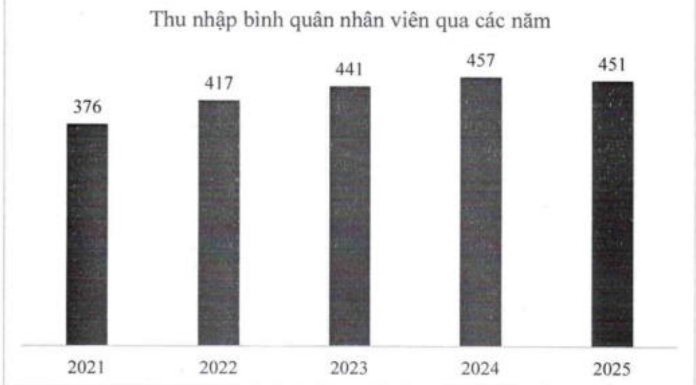

Năm 2025, thu nhập bình quân của cán bộ nhân viên ngân hàng là 451 triệu đồng/năm. Thu nhập bình quân năm 2025 tại ACB cao gấp 7.6 lần so với mức lượng tối thiểu vùng I được quy định đối với người lao động làm việc theo hợp đồng lao động.

2.2.3. Tóm tắt chính sách và thay đổi trong chính sách đối với người lao động

Xin xem CHƯỜNG 6 BÁO CÁO PHÁT TRIỂN BỂN VỮNG, mục 6.7.2 Chính sách lao động nhằm đảm bảo sức khỏe, an toàn và phúc lợi của người lao động.

## 2.3. Tinh hình đấu tư, tình hình thực hiện các dự án

### 2.3.1. Các khoản đấu tư lớn

Năm 2025, ACB đã thực hiện một số khoản đầu tư, góp vốn mang tính chiến lược nhằm tăng cường vốn cho các công ty con giúp mở rộng quy mô hoạt động, nâng cao hiệu quả kinh doanh và năng lực quản trị rủi ro, góp phần tạo dụng bước dà vững chắc cho hành trình chuyển đổi theo tầm nhìn 2025–2030 trở thành tập đoàn tài chính hiệu quả.

ACBS: ACB đã thực hiện tăng vốn đầu tư tại công ty con ACBS từ 7.000 tỷ đồng lên 11.000 tỷ đồng. Việc bổ sung nguồn vốn nhằm nâng cao năng lực tài chính cho ACBS, thức đầy hoạt động cho vay ký quỹ (margin), mở rộng hoạt động tự doanh, đầu tư nâng cấp hệ thống công nghệ giao dịch, cũng như gia tăng khả năng cạnh tranh của mảng môi giới chứng khoản. Đây là bước đi chiến lược giúp ACBS cải thiện hiệu quả vận hành, da dạng hóa các sản phẩm tài chính và nâng cao chất lượng dịch vụ khách hàng, đồng thời gia tăng đóng góp vào doanh thu phí và sự phát triển dài hạn của toàn tập đoàn.