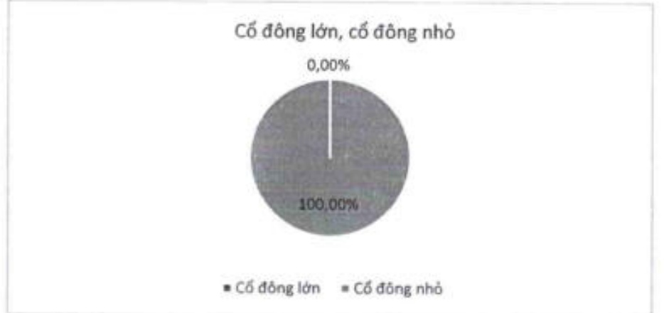
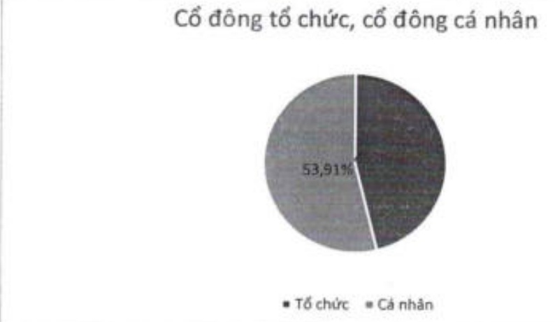

2.5.2.b Theo tiêu chí cổ động tố chức và cổ động cá nhân

<table border=1 style='margin: auto; word-wrap: break-word;'><tr><td style='text-align: center; word-wrap: break-word;'>Tiêu chí</td><td style='text-align: center; word-wrap: break-word;'>Số lượng cổ đông</td><td style='text-align: center; word-wrap: break-word;'>Số lượng cổ phần</td><td style='text-align: center; word-wrap: break-word;'>Tỷ lệ sở hữu cổ phần (%)</td></tr><tr><td style='text-align: center; word-wrap: break-word;'>Tổ chức</td><td style='text-align: center; word-wrap: break-word;'>578</td><td style='text-align: center; word-wrap: break-word;'>2.367.289.892</td><td style='text-align: center; word-wrap: break-word;'>46,09</td></tr><tr><td style='text-align: center; word-wrap: break-word;'>Cá nhân</td><td style='text-align: center; word-wrap: break-word;'>100.601</td><td style='text-align: center; word-wrap: break-word;'>2.769.366.707</td><td style='text-align: center; word-wrap: break-word;'>53,91</td></tr><tr><td style='text-align: center; word-wrap: break-word;'>Tổng cộng</td><td style='text-align: center; word-wrap: break-word;'>101.179</td><td style='text-align: center; word-wrap: break-word;'>5.136.656.599</td><td style='text-align: center; word-wrap: break-word;'>100,00</td></tr></table>

2.5.2.c Theo tiêu chí cổ động trong nước và cổ động nước ngoài

<table border=1 style='margin: auto; word-wrap: break-word;'><tr><td style='text-align: center; word-wrap: break-word;'>Tiêu chí</td><td style='text-align: center; word-wrap: break-word;'>Số lượng cổ đông</td><td style='text-align: center; word-wrap: break-word;'>Số lượng cổ phần</td><td style='text-align: center; word-wrap: break-word;'>Tỷ lệ sở hữu cổ phần (%)</td></tr><tr><td style='text-align: center; word-wrap: break-word;'>Cổ đông trong nước</td><td style='text-align: center; word-wrap: break-word;'>100.735</td><td style='text-align: center; word-wrap: break-word;'>3.667.587.471</td><td style='text-align: center; word-wrap: break-word;'>71,40</td></tr><tr><td style='text-align: center; word-wrap: break-word;'>Cổ đông nước ngoài</td><td style='text-align: center; word-wrap: break-word;'>444</td><td style='text-align: center; word-wrap: break-word;'>1.469.069.128</td><td style='text-align: center; word-wrap: break-word;'>28,60</td></tr><tr><td style='text-align: center; word-wrap: break-word;'>Tổng cộng</td><td style='text-align: center; word-wrap: break-word;'>101.179</td><td style='text-align: center; word-wrap: break-word;'>5.136.656.599</td><td style='text-align: center; word-wrap: break-word;'>100,00</td></tr><tr><td style='text-align: center; word-wrap: break-word;'>Cổ đông nhà nước</td><td style='text-align: center; word-wrap: break-word;'>1</td><td style='text-align: center; word-wrap: break-word;'>1.017</td><td style='text-align: center; word-wrap: break-word;'>0,00</td></tr><tr><td style='text-align: center; word-wrap: break-word;'>Cổ đông khác</td><td style='text-align: center; word-wrap: break-word;'>101.178</td><td style='text-align: center; word-wrap: break-word;'>5.136.655.582</td><td style='text-align: center; word-wrap: break-word;'>100,00</td></tr><tr><td style='text-align: center; word-wrap: break-word;'>Tổng cộng</td><td style='text-align: center; word-wrap: break-word;'>101.179</td><td style='text-align: center; word-wrap: break-word;'>5.136.656.599</td><td style='text-align: center; word-wrap: break-word;'>100,00</td></tr></table>

2.5.2.d Theo tiêu chí cổ động nhà nước và các cổ động khác