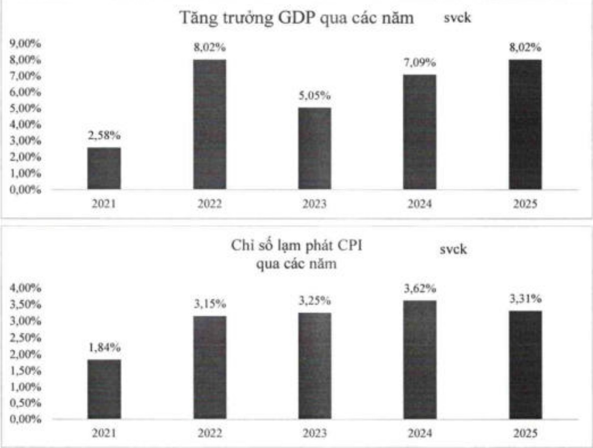

#### CHƯƠNG 3. BÁO CÁO VÀ ĐÁNH GIÁ CỦA BAN ĐIỂU HÀNH

## 3.1. Môi trường kinh doanh, cơ hội, rủi ro và thách thức

### 3.1.1. Kinh tế toàn cầu và Việt Nam năm 2025 – Dự báo 2026

Năm 2025 ghi nhận nhiều biến động trên bình diện thương mại, tài chính và địa chính trị toàn cầu. Các biện pháp thuế quan đối ứng, sự dịch chuyển chuỗi cung ứng và tốc độ phát triển mạnh mẽ của công nghệ AI tiếp tục tạo ra áp lực đáng kể đối với thị trường tài chính quốc tế. Mặc dù vậy, kinh tế thế giới vẫn duy trì được tăng trưởng trung bình, tránh được kịch bản suy thoái sâu nhờ sự thích ứng linh hoạt của doanh nghiệp và chính sách tiền tệ dần chuyển sang nội lòng thận trọng tại các nền kinh tế lớn.

Trong bối cảnh đó, kinh tế Việt Nam tiếp tục khảng định sức chống chịu và vị thế điểm sáng trong khu vực với GDP tăng trưởng 8,02%, thuộc nhóm cao nhất khu vực và ba biến số vĩ mô then chốt - tỷ giá, lãi suất và lạm phát - được kiểm soát ổn định, tiếp tục tạo nền tăng cho tăng trưởng bền vững trong đó làm phát bình quân được kiểm soát ở mức 3,31%.

