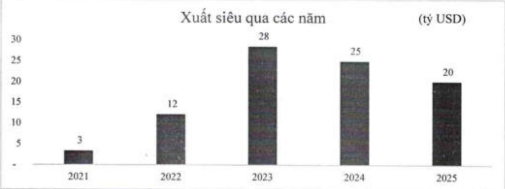

Bước sang năm 2026, triển vọng kinh tế Việt Nam được đánh giá tích cực, nhờ kỳ vọng môi trường bên ngoài ổn định hơn và chu kỳ nối lòng tiền tệ toàn cầu đang được duy trì. Các cải cách thể chế và chiến lược phát triển kinh tế số, kinh tế xanh, cùng sự phục hồi của khu vực tư nhân, được dự báo sẽ tạo động lực tăng trưởng mới. Tuy nhiên, rủi ro địa chính trị, áp lực cạnh tranh chiến lược trong chuỗi cung ứng và biến động giá năng lượng vấn là những yếu tố cần theo dõi chất chẽ.

#### 3.1.2. Ngành ngân hàng năm 2026: Rùi ro - Cơ hội - Thách thức

### (1) Bối cảnh chung và xu hướng chính

Năm 2026, ngành ngân hàng Việt Nam tiếp tục đóng vai trò huyết mạch trong hỗ trợ tăng trưởng kinh tế. Nợ xấu – bao gồm cả nợ xấu tiềm ẩn – dự kiến chịu áp lực gia tăng trong bối cảnh doanh nghiệp văn đang phục hồi sau giai đoạn khó khăn kéo dài. Trong khi đó, nhu cầu tín dụng duy trì ở mức cao nhằm đáp ứng mục tiêu tăng trưởng của nền kinh tế. Dư địa điều hành của các tổ chức tín dụng có xu hướng thu hẹp hơn, đòi hỏi kỳ luật cao về quản trị rủi ro, đảm bảo an toàn vốn và cân đối thanh khoản một cách chủ động.

### (2) Cơ hội đối với ngành ngân hàng năm 2026

Môi trường vĩ mô tiếp tục ổn định, tạo thuận lợi cho hoạt động tín dụng và đầu tư.

Tỷ giá được dự báo giảm áp lực nhờ kỳ vọng Cục Dự trữ Liên bang Mỹ (Fed) tiếp tục lộ trình giám lãi suất, triển vọng nâng hạng thị trường chứng khoản Việt Nam, mặt bằng lãi suất huy động VND đã ở mức hấp dẫn hơn, và dòng vốn vay nước ngoài có thể được kích hoạt trở lại.

Như cầu tín dụng tăng trưởng tích cực trong khu vực kinh tế tư nhân và các lĩnh vực ưu tiên như hạ tầng, kinh tế số, năng lượng xanh và doanh nghiệp nhỏ và vừa (SME). Các động lực này gắn với hàng loạt chính sách quan trọng, bao gồm: Nghị quyết số 79-NQ/TW ngày 29/12/2023 của Bộ Chính trị về đầy mạnh phát triển kinh tế tư nhân; Nghị quyết số 68/NQ-CP ngày 12/5/2024 của Chính phủ về cải thiện môi trường đầu