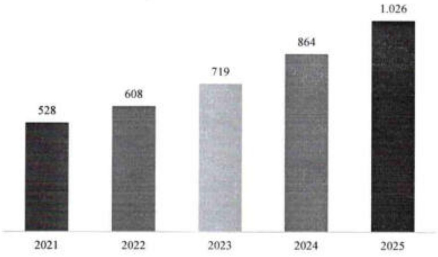

phân khúc khách hàng trọng tâm. Trong khuôn khổ Chiến lược này, ACB đã đề ra hơn 20 sáng kiến chiến lược và tính đến cuối năm 2025 đang thực thi khoảng 1/3 các sáng kiến.

Hoàn thiện khung quản trị phát triển bền vững với việc xây dựng Chiến lược phát triển bền vững cho giai đoạn 2026 - 2030 và công bố mô hình phát triển bền vững theo hướng tạo giá trị chung (CSV), đánh dấu bước chuyển từ các hoạt động trách nhiệm xã hội (CSR) rời rạc sang cách tiếp cận hệ thống, dài hạn và do lường được, gắn với Chiến lược kinh doanh của Ngân hàng trong giai đoạn 2025-2030.

### 3.2.2. Tình hình tài chính

### 3.2.2.a Tinh hình tài sản

##### Tổng tài sản

Tổng tài sản hợp nhất tăng trưởng bình quân 18% trong 5 năm liên tiếp từ 2021 đến 2025. Cuối năm 2025, tổng tài sản đạt 1.026 nghìn tỷ, tăng 18.7% so cuối năm 2024.

Tổng tài sản (nghin tỷ đồng)

