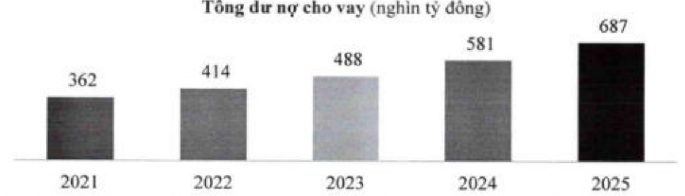
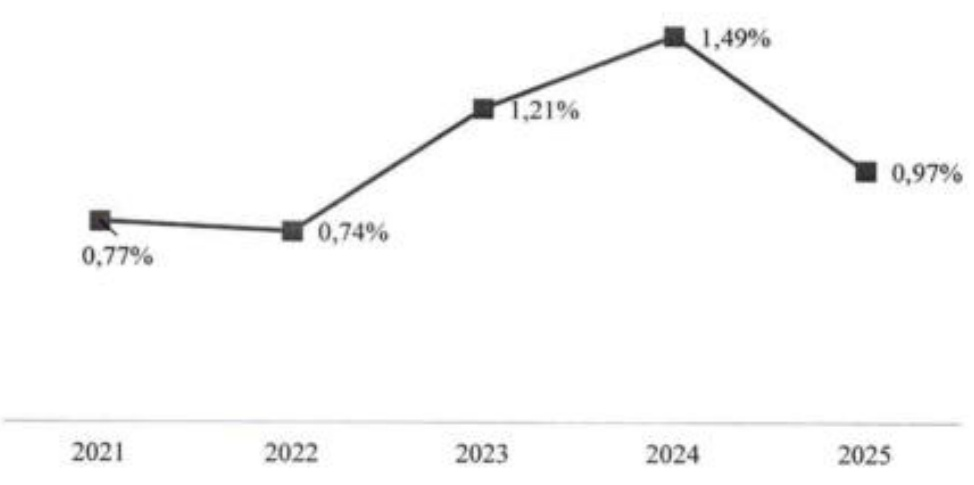

Cho vay là động lực chính của tăng trưởng tổng tài sản với dự nợ cho vay thời điểm 31/12/2025 đạt 687 nghìn tỷ đồng, tăng 18,3% so với 2024.

##### Hiệu quả sử dụng tài sản:

Tỷ trọng tài sản có sinh lời được duy trì ở mức cao và đạt 97% tổng tài sản vào cuối năm 2025, nhờ tập trung vào các lĩnh vực ít rùi ro và có tiềm năng trưởng ổn định.

Với chính sách cho vay có chọn lọc và kiểm soát rùi ro chặt chẽ, ACB đảm bảo dòng vốn hướng vào các lĩnh vực rùi ro thấp - nền tàng giúp ngân hàng tăng trưởng bền vững với chất lượng tài sản cao. Ngân hàng đã chứng kiến nợ xấu có xu hướng suy giảm đáng khích lệ qua hàng quý. Tới cuối năm 2025, dư nợ cho vay nhóm 3 đến nhóm 5 hợp nhất của ACB

chỉ còn chiếm 0,97% tổng dư nợ cho vay khách hàng, cải thiện đáng kể so với cuối năm 2024 (1,49%).

Chất lượng danh mục cho vay

